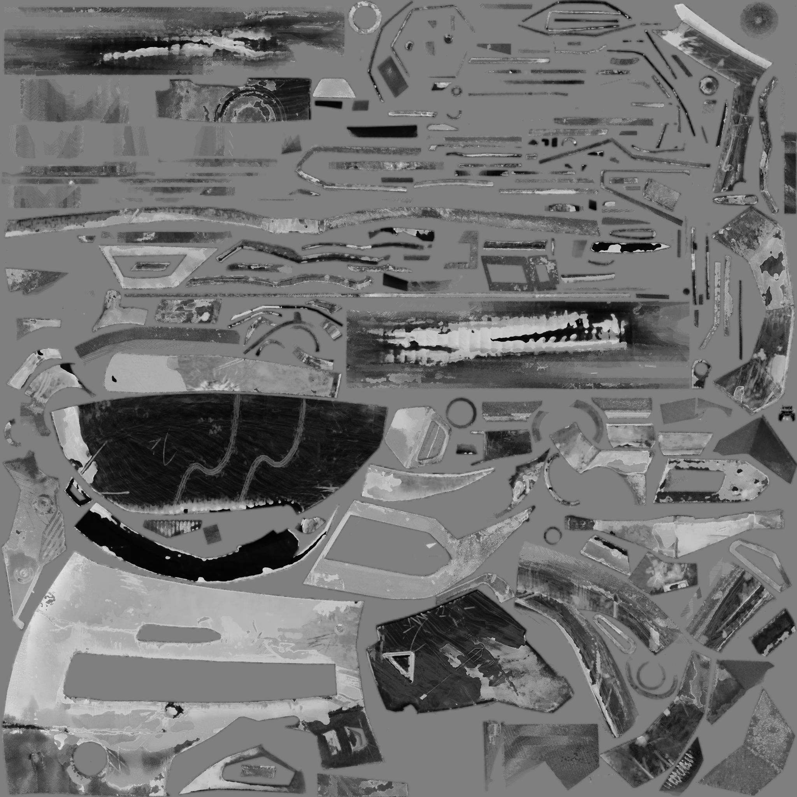
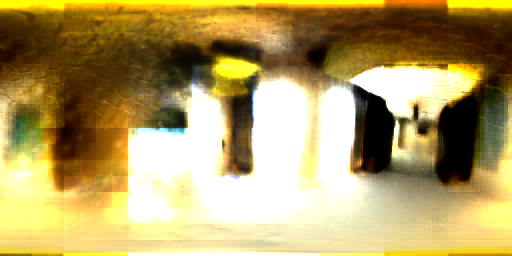

# 可微烘焙管线 (Differentiable Baking Pipeline)

基于 PyTorch + nvdiffrast 的可微渲染烘焙管线，将高模多视角 GT 渲染图反向优化为低模纹理。支持 **SH 辐射场** 和 **Split-Sum PBR** 两种着色模型，面向移动端部署。

## 训练结果

| 场景 | 着色模型 | PSNR | 纹理分辨率 | 备注 |
|------|---------|------|-----------|------|
| 头盔 | SH (order 2) | 13.19 dB | 2048×2048 | |
| 头盔 | PBR (split-sum) | **21.97 dB** | 2048×2048 | |
| 钢琴 | SH (order 2) | 20.37 dB | 2048×2048 | |
| 钢琴 | PBR (split-sum) | 21.41 dB | 2048×2048 | 效果未达预期，见分析 |

> 头盔含金属面罩，PBR split-sum 捕捉镜面反射提升 +8.8 dB；钢琴以漫反射为主，PBR 仅有 +1.0 dB 增益。

### 可视化结果 — 头盔 PBR (2000 epochs)

渲染对比 Atlas（左上：GT，右上：渲染，左下：Diffuse，右下：Specular）：

<p align="center">


</p>

训练曲线（Loss / PSNR）：

<p align="center">

</p>

分解材质贴图（base_color / roughness / metallic / normal）：

<p align="center">




</p>

学习到的环境贴图：

<p align="center">

</p>

### 实验分析

**GT 材质初始化实验**：使用 DamagedHelmet 原始材质贴图（albedo / metallicRoughness / normal）+ 环境光 EXR 初始化 PBR 管线，训练 2000 epochs 后峰值 22.17 dB，相比 random init 的 21.97 dB 仅提升 +0.20 dB。说明材质初始化不是瓶颈，~22 dB 是 split-sum 着色模型在当前配置下的收敛上限。

**局限分析**：split-sum 近似无全局光照（GI）、无阴影、无多次弹射，与 Blender Cycles path tracing 存在本质差距。AO/自发光等缺失效果会被优化吸收到 base_color 和 env_map 中。

**钢琴 PBR 效果不佳的原因**：

- **几何复杂度高**：钢琴原始模型 93875 顶点（6 个子模型），低模 70686 顶点，减面比例小但子模型间接缝和穿插导致渲染伪影
- **多材质混合**：钢琴包含木质琴身（diffuse）、金属琴弦（specular）、黑白键（高对比）等多种材质，单张 8ch 材质贴图难以同时表达
- **UV 空间竞争**：多个子模型共享一张纹理，UV 岛之间空间分配不均，细节区域（琴弦、琴键）分辨率不足
- **场景尺度大**：钢琴场景包围盒远大于头盔，相机分布更稀疏，单位面积采样密度低

## 功能

### 通用
- **半球采样相机生成** — Fibonacci 均匀分布，支持随机 FOV 波动
- **Cycles GT 渲染** — 自动逐相机渲染高质量 GT 图像（Blender `--background` 批量渲染）
- **Coarse-to-Fine 训练** — 512→1024→2048 多分辨率渐进训练
- **UV Seam Padding** — 自动膨胀填充 UV 岛边界，消除黑边
- **数据集管理** — 按 `{scene}_{yymmdd}` 组织训练数据和输出，自动关联
- **视频自动相机** — 根据 mesh bounding box 自适应计算相机参数

### SH 着色 (v0.2)
- **3DGS 风格 SH 参数化** — DC / 高阶分离存储，独立学习率（高阶 lr = DC lr × rest_lr_ratio）
- **动态 SH Order** — 支持 order 0 / 1 / 2，通过配置文件切换
- **调试输出** — 2×2 compare atlas (GT / Full SH / DC / High Freq) + 多视频 (Full / DC / HF)

### PBR Split-Sum (v0.3)
- **Split-Sum 近似** — diffuse irradiance + prefiltered specular + BRDF LUT (Karis 2014)
- **8ch PBR 材质贴图** — base_color (3) + roughness (1) + metallic (1) + normal_xyz (3)，sigmoid 约束
- **Tangent-Space 法线贴图** — Mikktspace 风格切线计算，TBN 变换到世界空间
- **HDR 环境贴图** — Equirect 参数化，softplus 解码，nvdiffrast `dr.texture` 内置 mipmap
- **GGX BRDF LUT** — 全 PyTorch 向量化 importance sampling，能量守恒 (A+B ≤ 1)
- **联合优化** — 材质贴图 + 环境贴图同时优化，TV + L2 正则化防爆炸
- **分量视频** — Diffuse / Specular 分离环绕视频
- **可插拔着色模型** — `ShadingModel` 协议 + 工厂函数，SH/PBR 透明切换

## 项目结构

```
├── src/
│   ├── camera.py              # 相机加载 & Blender→OpenGL 坐标转换
│   ├── mesh.py                # OBJ/GLB 网格加载 + Mikktspace 切线计算
│   ├── dataset.py             # GT 图像 + 相机关联 Dataset
│   ├── sh.py                  # 球谐基函数 & RGB2SH/SH2RGB
│   ├── renderer.py            # nvdiffrast 可微渲染器 (7 值输出含 TBN)
│   ├── losses.py              # L1 + Masked SSIM + TV Loss
│   ├── seam_padding.py        # UV 边界膨胀
│   ├── trainer.py             # 训练主循环 + env TV/L2 正则化
│   ├── video.py               # 环绕视频渲染
│   ├── exporter.py            # 资产导出 (Diffuse / SH 通道 / glTF)
│   ├── utils.py               # 可视化工具
│   ├── config.py              # YAML 配置系统
│   └── shading/
│       ├── __init__.py        # create_shading_model 工厂
│       ├── base.py            # ShadingModel 协议
│       ├── logger.py          # ShadingLogger 基类 + 工厂
│       ├── sh_model.py        # SHShadingModel
│       ├── sh_logger.py       # SH 调试日志
│       ├── pbr_model.py       # PBRShadingModel (split-sum + TBN)
│       ├── pbr_logger.py      # PBR 调试日志 + 分量视频
│       └── pbr/
│           ├── __init__.py
│           ├── material.py    # 8ch sigmoid 材质参数化
│           ├── env_map.py     # EnvironmentMap (nn.Module)
│           └── brdf_lut.py    # GGX BRDF LUT generation
├── scripts/
│   ├── blender_export.py      # Blender 数据导出脚本
│   ├── run_ablation.py        # SH0 vs SH2 对照实验
│   └── README.md              # 数据制备 SOP
├── configs/
│   ├── default.yaml           # 默认配置 (SH order 2)
│   ├── train_sh0.yaml         # SH order 0
│   ├── train_1k.yaml          # 1K 分辨率快速训练
│   ├── train_helmet.yaml      # 头盔 SH 配置
│   ├── train_pbr.yaml         # 头盔 PBR 配置
│   ├── train_pbr_piano.yaml   # 钢琴 PBR 配置
│   └── quick_test.yaml        # 快速验证
├── tests/                     # 单元测试
├── data/                      # 训练数据 (gitignore)
│   └── {scene}_{yymmdd}/
│       ├── scene/lowpoly.glb
│       ├── gt/
│       └── cameras.json
├── output/                    # 训练输出 (gitignore)
├── asset/                     # Blender 工程文件 (gitignore)
└── main.py                    # CLI 入口
```

## 环境搭建

```bash
conda env create -f environment.yml
conda activate differentiable

# 安装 nvdiffrast
pip install git+https://github.com/NVlabs/nvdiffrast.git --no-build-isolation
```

## 数据准备

训练数据由三部分组成：低模几何 (`lowpoly.glb`)、多视角 GT 渲染图 (`gt/*.png`)、相机参数 (`cameras.json`)，按 `{scene}_{yymmdd}` 目录组织：

```
data/{scene}_{yymmdd}/
├── scene/lowpoly.glb      # 低模几何（已完成减面 + UV 展开）
├── gt/view_0000.png       # 多视角 Cycles GT 渲染图
├── gt/view_0001.png
└── cameras.json           # 相机参数 (position, look_at, fov, ...)
```

### 前置条件

| 项目 | 要求 |
|------|------|
| Blender | 3.x 及以上（推荐 4.x） |
| 高模 | 已完成材质、灯光、场景搭建 |
| 低模 | 已完成减面（Decimate）、UV 展开（无重叠），与高模位置对齐 |
| 磁盘空间 | 每视角约 3-4 MB（1024×1024 PNG），100 视角 ≈ 350 MB |

### 方法一：自动化脚本（推荐）

`scripts/blender_export.py` 一键完成所有步骤：隐藏低模 → 显示高模 → Fibonacci 半球采样生成相机 → 逐相机 Cycles 渲染 GT → 导出 cameras.json → 导出低模 GLB。

```bash
blender --background asset/scene.blend --python scripts/blender_export.py
```

脚本顶部可配置参数（场景名、视角数量、采样半径、Cycles 采样数、分辨率等），详见 [scripts/README.md](scripts/README.md)。

### 方法二：通过 Blender MCP

[Blender MCP](https://www.blender.org/lab/mcp-server/) 允许通过 AI 编程工具（如 Cursor、Claude Code、OpenCode）直接操作 Blender，交互式完成数据制备。

**安装 MCP 插件：**

按照 [Blender MCP 官方教程](https://www.blender.org/lab/mcp-server/) 安装并启用插件。

**交互式制备流程：**

通过 MCP 连接 Blender 后，可以用自然语言指令逐步完成：

1. **导出低模** — 指示 Blender 选中低模对象，导出为 GLB 格式到 `data/{scene}_{yymmdd}/scene/lowpoly.glb`
2. **生成相机** — 使用 Fibonacci 半球采样在上半球均匀分布 50-200 个相机，对准模型中心
3. **渲染 GT** — 逐相机用 Cycles 渲染（采样数 ≥ 256，分辨率 1024×1024），保存到 `data/{scene}_{yymmdd}/gt/view_XXXX.png`
4. **导出相机参数** — 记录每个相机的 position / look_at / up / fov_deg / image_size / image_path，保存为 `cameras.json`

> **提示**：MCP 方式适合需要人工检查中间结果、或场景较为复杂需要调试的情况。自动化脚本适合标准化批量生产。

### cameras.json 格式

```json
{
  "blender_coordinate": true,
  "cameras": [
    {
      "position": [1.234, -0.567, 0.891],
      "look_at": [0.0, 0.0, 0.0],
      "up": [0.0, 0.0, 1.0],
      "fov_deg": 45.0,
      "image_size": [1024, 1024],
      "image_path": "gt/view_0000.png"
    }
  ]
}
```

- `blender_coordinate: true` 表示使用 Blender 坐标系（Z-up, 右手系），训练管线会自动转换为 OpenGL 标准坐标
- `image_path` 相对于数据集根目录

### 验证数据完整性

```bash
python -c "
import json, os
cams = json.load(open('data/{scene}_{yymmdd}/cameras.json'))
gt = [f for f in os.listdir('data/{scene}_{yymmdd}/gt') if f.endswith('.png')]
print(f'Cameras: {len(cams[\"cameras\"])}, GT images: {len(gt)}')
assert len(cams['cameras']) == len(gt), 'Mismatch!'
print('OK')
"
```

## 训练

```bash
# SH 着色 (默认)
python main.py --config configs/default.yaml --mode train

# PBR split-sum
python main.py --config configs/train_pbr.yaml --mode train

# 断点续训
python main.py --config configs/train_pbr.yaml --mode train --resume output/{dataset}/checkpoint.pt
```

## 导出 & 视频

```bash
# 导出贴图
python main.py --mode export --checkpoint output/{dataset}/checkpoint.pt

# 环绕视频
python main.py --mode video --checkpoint output/{dataset}/checkpoint.pt
```

## 测试

```bash
pytest tests/ -v
```

## 技术栈

- Python 3.10, PyTorch 2.x, nvdiffrast
- Blender 5.1 (数据制备)
- trimesh, OpenCV, Pillow, matplotlib

## License

Private
