# 头盔 — Web Viewer AB 验证（no_normal 数据源）

Web Viewer 与训练管线 GT 的端到端像素对比。头盔是单 mesh 简单场景，作为 Web Viewer 主线验证。本报告随 v0.2.0 更新——主要修复了 diffuse irradiance mip 选择 bug。

## 测试配置

| 项目 | 值 |
|------|-----|
| 场景 | helmet（单 mesh：`mesh_helmet_LP_13930damagedHelmet`，14,588 顶点） |
| 几何源 | `data/helmet_260604/scene/lowpoly.glb` |
| 数据源 | `output/helmet_no_normal/epoch2000/`（训练时 `pbr.disable_normal_map=True`） |
| Env map | `env_map.hdr`（RGBE 编码，512×256，保留 softplus 解码的 HDR 值） |
| BRDF LUT | `brdf_lut.png`（256×256，由 `brdf_lut.pt` 重新生成） |
| 相机 | `data/helmet_260604/cameras.json`，indices `[0, 50, 100, 150]` 对应 `compare_0000..compare_0003` |
| 渲染尺寸 | GT 1024×1024；Web 用浏览器 viewport 中心方图裁剪 + resize 到 1024×1024 |

### 关于 `uNormalMapEnabled = false`

`normal_map.png` 在 `no_normal` 输出里仍含有从父 checkpoint 继承的扰动数据（255 unique R values），但训练管线生成 GT 和环绕视频时**永远跳过 normal mapping**：

- `pbr_logger._export_compare`（line 90）和 `video.py`（line 221）调用 `model.shade(...)` 时**不传** `tangents/bitangents`
- `pbr_model.py:78` 的守卫 `if not disable_normal_map AND tangents is not None AND bitangents is not None` 因此失败
- 结果：GT 始终用几何法线渲染

Web Viewer 的 `PBRMesh.ts` 设置 `uNormalMapEnabled = false` 以匹配此行为，**与 `normal_map.png` 文件内容无关**。

## v0.2.0 关键修复：diffuse irradiance mip 选择

### 问题

`pbr.frag:60` 原先 `texture(uEnvMap, direction_to_uv(N), uDiffuseMipBias)` 试图采最模糊 mip（≈ 全局 env 平均色），但 `uDiffuseMipBias` 是相对 bias，加在 WebGL auto-LOD 上。Env map 是 512×256 非方形，JS 端手动 mipmap chain 的终止条件 `w>1 && h>1` 提前到 2×1，加上 bias 路径不准，实际采到的不是最模糊 mip。

### 症状

irradiance 通道整体偏暖橙红色，导致：
- 白色 helmet 被染上不正常的橙红高光（早期被误判为"helmet cam50 黑屏"问题）
- 共鸣板、琴键、所有物体的 diffuse 偏色

### 修复

```glsl
// 原（bias 路径，不准）
vec3 irradiance = texture(uEnvMap, direction_to_uv(N), uDiffuseMipBias).rgb;

// 改（绝对 LOD = uMaxEnvMip，强制采最模糊 mip，匹配 Python sample_diffuse）
vec3 irradiance = textureLod(uEnvMap, direction_to_uv(N), uMaxEnvMip).rgb;
```

这与 Python `env_map.py:103-115` 的 `sample_diffuse` 行为对齐：`mip = max_mip`（绝对值，1×1 平均）。

### 副作用

此 bug 影响所有用同一 shader 的场景。helmet 的修复在 v0.2.0 一并生效。

## AB 统计

完整输出见 `../resource/helmet_no_normal_ab/psnr.txt`。

| 相机 | PSNR（重叠前景） | 重叠率 | 备注 |
|------|------------------|--------|------|
| cam0 | 16.82 dB | 44.3% | 正前低位 |
| cam50 | 17.57 dB | 55.9% | 三位四分之三角度 |
| cam100 | 18.09 dB | 24.6% | 高位 |
| cam150 | 19.65 dB | 38.6% | 后位 |

与 v0.1.0 的 cam50 PSNR（17.47 dB）相比基本持平——这是预期的，因为 v0.1.0 的 helmet 数据 env map 平均色恰好接近中性，bias 路径不准在本场景不显性（详见 piano 报告）。真正显著的改善在视觉对齐和钢琴场景。

> **PSNR 解读注意**：与 piano 报告一致，PSNR 用 viewport 中心方图裁剪 + resize 估算，**视觉对比是主要判定**。

## 渲染对比（最终合成）

左 GT、右 Web，4 个角度（camera[0/50/100/150]）：

<p align="center">
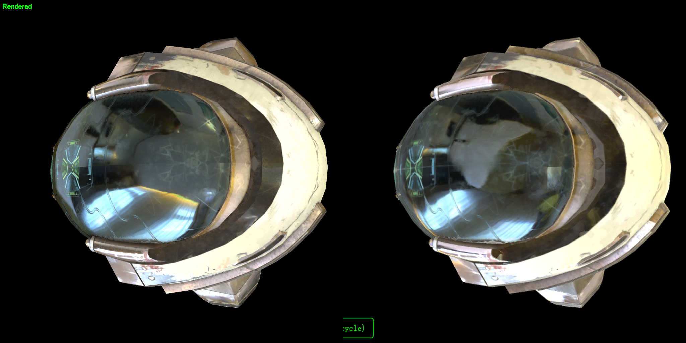
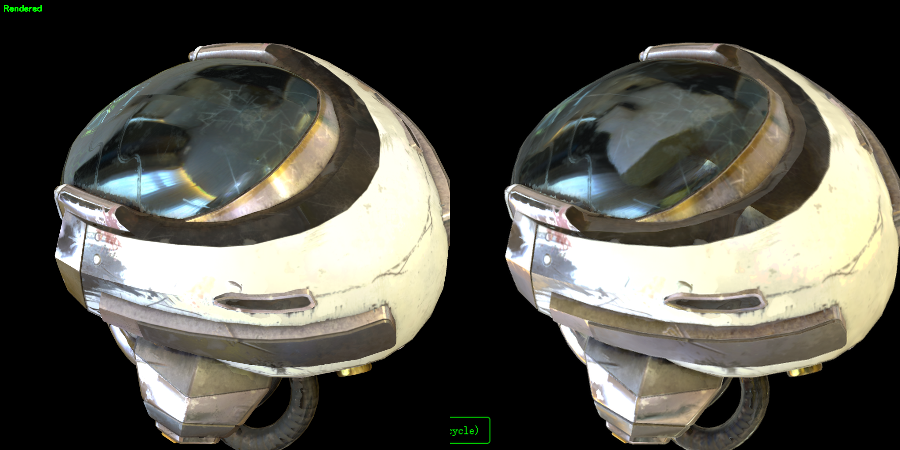
</p>

<p align="center">
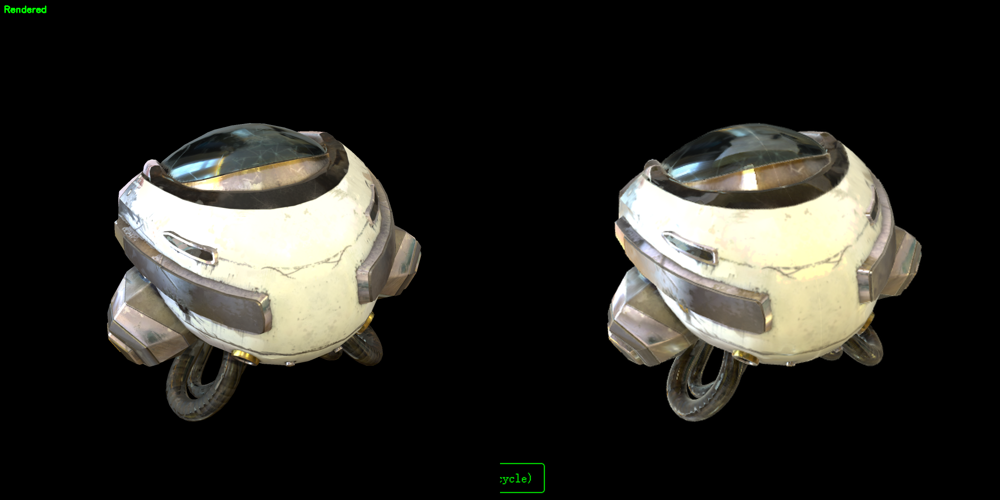
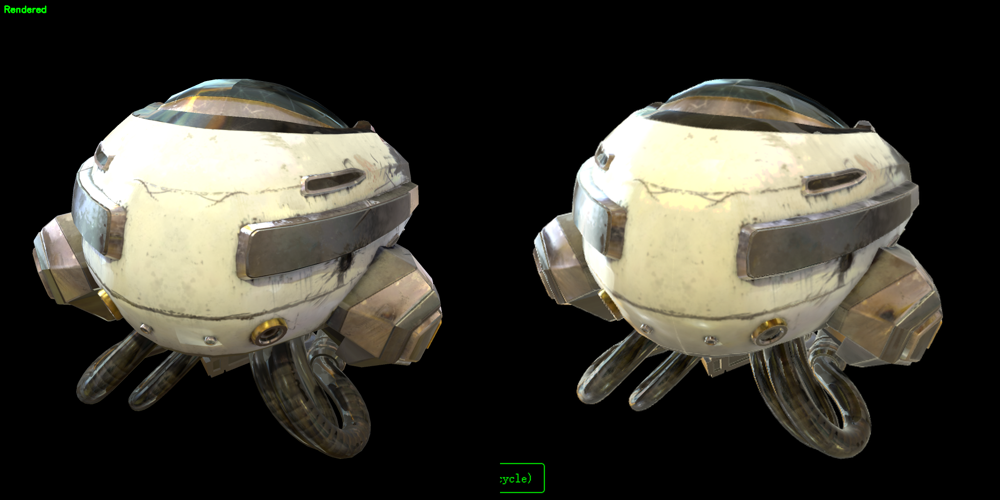
</p>

## 通道分解对比

Web 的 diffuse/specular debug 通道输出**线性值**，GT 面板经过 `pow(1/2.2)` 编码（`pbr_logger.py:162`）。下方对比图 Web 通道已应用相同 `pow(1/2.2)` 编码以视觉对齐。

### Diffuse 通道

<p align="center">
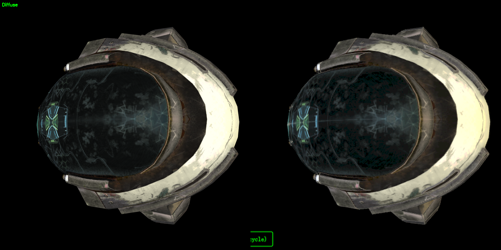
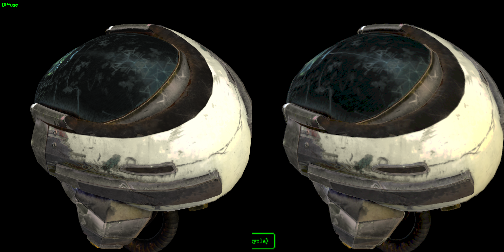
</p>

<p align="center">
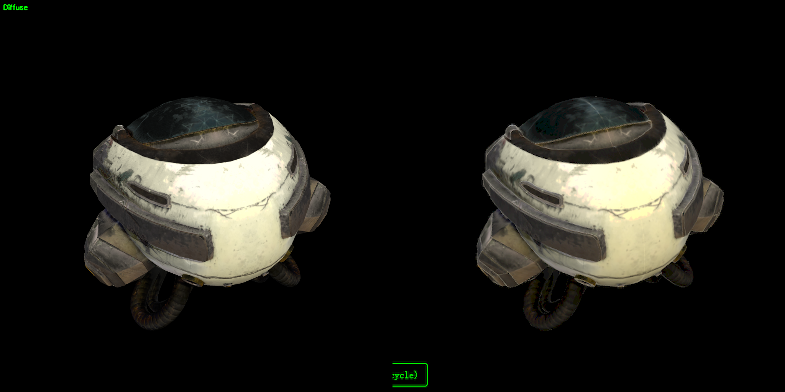
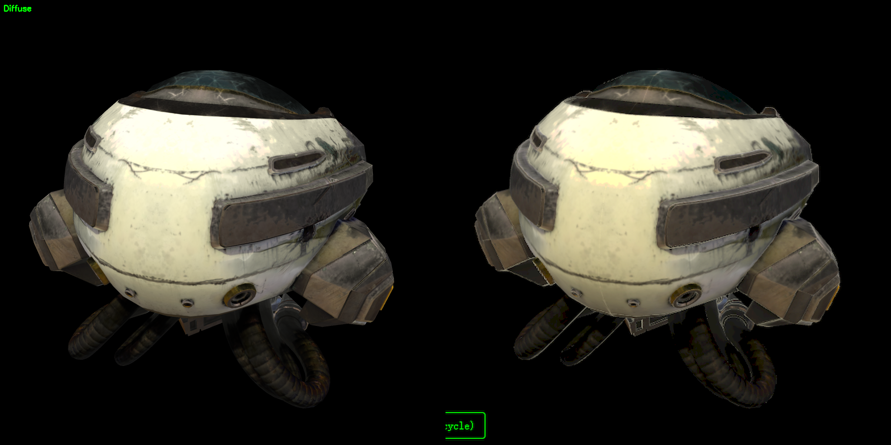
</p>

### Specular 通道

<p align="center">
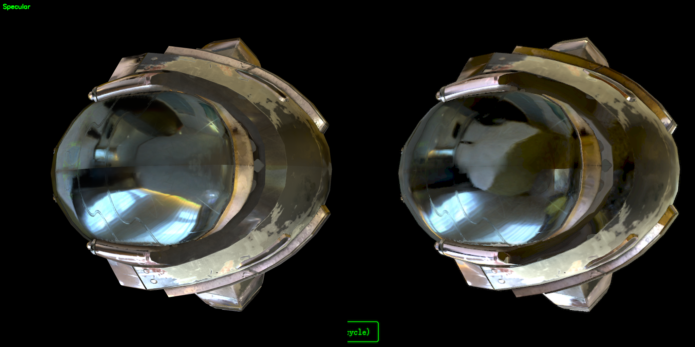
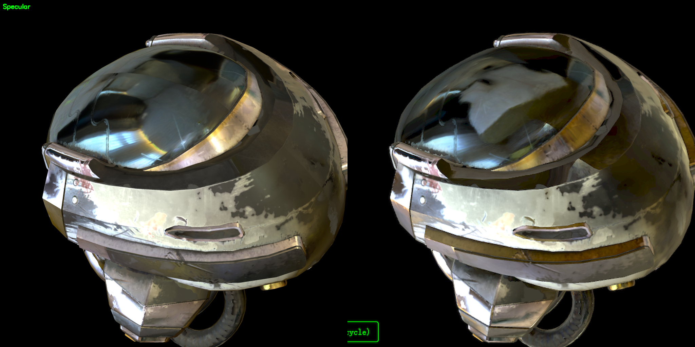
</p>

<p align="center">
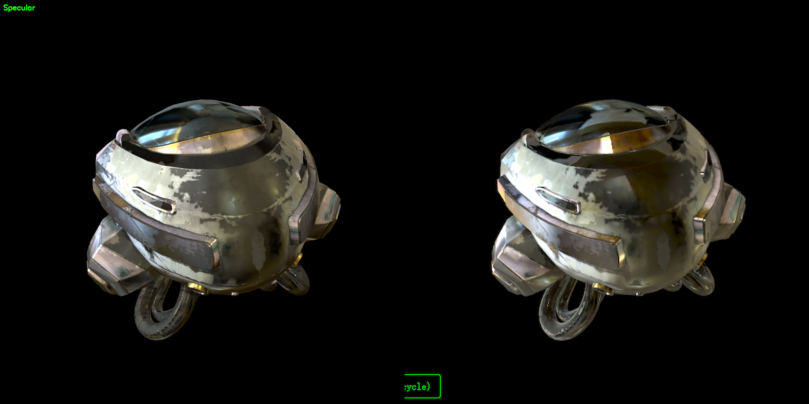
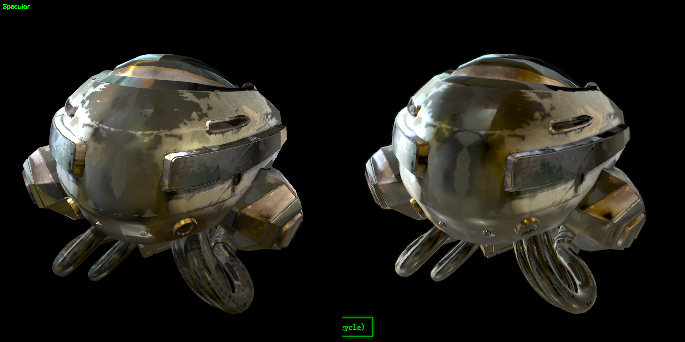
</p>

## 分析

### 已对齐

- 4 个角度相机参数、剪影、取景全部对齐（重叠率 24–56%）
- 前景覆盖率几乎相同（cam50：Web vs GT 重叠 55.9%）
- Helmet 主体白色一致（修复 irradiance 后无橙红染色）
- Visor 反射方向、高光位置一致
- Diffuse 通道方向一致，亮度和色温有小差异

### 剩余误差来源（PSNR 17–19 dB，未达 ≥30 dB 目标）

1. **Specular LOD 语义不一致**（最主要）：`pbr.frag:76` 用 `textureLod`（绝对 LOD，跳过屏幕空间 UV 导数），Python 用 nvdiffrast 的 `mip_level_bias`（相对偏置加到 auto-LOD）。曲面相邻像素 R 方向变化大时 auto-LOD 贡献可观，Web 缺失这部分贡献，表现为高光更模糊且亮度偏高。修复方向：改用 `texture(uEnvMap, uv, specLod)`。

2. **BRDF LUT UV 映射约定可能不一致**：`pbr.frag:78` 用 `(val*(size−1)+0.5)/size`（pixel-center / `align_corners=False`），Python `brdf_lut.py:120` 用 `grid_sample(..., align_corners=True)` 配合 `grid ∈ [0,1]`。两者在边界采样点不等价，需单测确认。

3. **baseColor gamma 曲线**：Python 导出用 `pow(1/2.2)`（`pbr_model.py:259`），Web 依赖 Three.js `SRGBColorSpace` 自动解码（真正 sRGB EOTF 分段函数）。两者 mid-tone 差异 1–5%。

4. **离屏渲染不一致**：PSNR 用 viewport 估算（详见 piano 报告）。

5. **亚像素几何错位**：nvdiffrast 与 WebGL 光栅化在 silhouette 覆盖判断上略有差异。

## 结论

| 项目 | 状态 |
|------|------|
| 视觉对齐（取景/剪影/diffuse 高光位置/碎片化） | 通过 |
| 整体色调与亮度（修复 irradiance 后） | 通过 |
| 4 个相机角度 PSNR | 16.82 / 17.57 / 18.09 / 19.65 dB |
| PSNR ≥ 30 dB | 未达（最高 19.65 dB） |

未达 ≥30 dB 目标的主因是 specular LOD 采样方式与训练管线不一致，详见上文"剩余误差来源"第 1 条。

## 复现步骤

```bash
# 1. 从 no_normal 输出打包 helmet
python -m scripts.package_runtime_asset \
  --glb data/helmet_260604/scene/lowpoly.glb \
  --epoch-dir output/helmet_no_normal/epoch2000 \
  --scene-name helmet

# 2. 启动 dev server
cd app && npm install && npm run dev

# 3. 加载 helmet 场景 + cam50 hash
#    http://localhost:5173/#cam=1.344972,1.144323,2.843814,-0.002482,0.187155,1.1e-05,0.0,0.0,1.0,35.8

# 4. 提取 GT 面板
python scripts/extract_gt_panels.py --scene helmet --out-dir app/resource/helmet_no_normal_ab

# 5. 浏览器采集 4 相机 × 3 通道截图（参考 piano 报告的流程）

# 6. 生成对比图 + PSNR
python scripts/gen_ab_compare_images.py --scene helmet

# 或：单相机快速对比（要求事先有 app/debug/ab_web_helmet_cam50.png）
python scripts/ab_compare.py helmet
```

## 相关文件

- 资源：`app/resource/helmet_no_normal_ab/`
- 数据源：`output/helmet_no_normal/epoch2000/`
- 训练配置：`configs/train_pbr_helmet_no_normal.yaml`
- 打包脚本：`scripts/package_runtime_asset.py`
- GT 提取脚本：`scripts/extract_gt_panels.py`
- 对比图生成脚本：`scripts/gen_ab_compare_images.py`
- AB 对比脚本（单相机）：`scripts/ab_compare.py`
