# 钢琴 — Web Viewer AB 验证（no_normal 数据源）

Web Viewer 与训练管线 GT 的端到端像素对比。钢琴场景包含 6 个子 mesh、深嵌套 node 层级（Sketchfab 原始资产），覆盖了 helmet 单 mesh 场景未触发的多个集成路径。

## 测试配置

| 项目 | 值 |
|------|-----|
| 场景 | piano（6 个 submesh：`Object_0..5`） |
| 几何源 | `data/piano_260604/scene/original_with_mats.glb` |
| 数据源 | `output/piano_no_normal/epoch2000/`（训练时 `pbr.disable_normal_map=True`） |
| Env map | `env_map.hdr`（RGBE 编码，512×256，保留 softplus 解码的 HDR 值） |
| BRDF LUT | `brdf_lut.png`（256×256） |
| 相机 | `data/piano_260604/cameras.json`，indices `[0, 50, 100, 150]` 对应 `compare_0000..compare_0003` |
| 渲染尺寸 | GT 1024×1024；Web 用浏览器 viewport 中心方图裁剪 + resize 到 1024×1024 |

## 本场景触发的关键修复

| 修复 | 位置 | 说明 |
|------|------|------|
| UV flipY 按场景区分 | `package_runtime_asset.py`、`manifest.ts`、`PBRMesh.ts`、`PBRPipeline.ts` | piano 的 GLB TEXCOORD_0 V 值域 `[0,1]`，`flipY=false`；helmet 的 V 值域 `[1,2]`，`flipY=true`。打包脚本按 V 均值（< 1.5 → false）自动检测，manifest 新增 `material_textures_flip_y` 字段贯通 |
| Mesh name 解析支持深嵌套 node | `PBRPipeline.ts` | Sketchfab 原始 GLB 有 7 层嵌套 node（Sketchfab_model → root → GLTF_SceneRootNode → … → Object_N），Three.js 加载后 mesh 挂在 `Object_7/19/10/12/14/16` 这类 node 上。新逻辑向上遍历 parent chain，命中 `meshNameSet`（直接 mesh.name）或 `nodeNameToMeshName`（node.name→mesh.name 映射） |
| DoubleSide 匹配 nvdiffrast | `PBRMesh.ts` | nvdiffrast `dr.rasterize()` 不做 culling，glTF material 是 `doubleSided: true`。Three.js ShaderMaterial 默认 FrontSide 会剔除钢琴琴键、内部木结构等背面。改成 `THREE.DoubleSide` 修复 |
| Diffuse irradiance 用 `textureLod(max_mip)` | `pbr.frag:60` | Python `env_map.sample_diffuse` 用绝对 LOD = `max_mip`（采样最模糊的 1×1 平均色），原 GLSL 用 `texture(..., uDiffuseMipBias)` 是相对 bias（加到 auto-LOD 上），实际采到的不是最模糊 mip。本场景 env map 是 512×256 非方形，JS 端 mipmap chain `w>1 && h>1` 终止条件更早停（最细只到 2×1），加上 bias 路径不准，结果是 irradiance 通道整体偏暖橙红，把白琴键染成橙色、共鸣板染成红木色。改 `textureLod(uEnvMap, direction_to_uv(N), uMaxEnvMip)` 后颜色恢复正常 |

## AB 统计

完整输出见 `../resource/piano_no_normal_ab/psnr.txt`。

| 相机 | PSNR（重叠前景） | 重叠率 | 备注 |
|------|------------------|--------|------|
| cam0 | 18.48 dB | 37.8% | 正前低位，俯仰最小 |
| cam50 | 25.99 dB | 34.8% | 三位四分之三角度，琴键/共鸣板清晰 |
| cam100 | 24.31 dB | 32.4% | 高位俯视 |
| cam150 | 19.58 dB | 32.8% | 后位俯视 |

PSNR 在 18–26 dB 之间。重叠率 30%+ 表明相机参数对齐良好。

> **PSNR 解读注意**：Web 用浏览器 viewport 中心方图裁剪 + LANCZOS resize 到 1024×1024 后跟 GT 比对，不是离屏 1024×1024 真渲染（离屏路径与 live viewport 渲染结果不一致是已知问题，见 README 遗留问题）。因此 PSNR 是相对参考，**视觉对比是主要判定**。

## 渲染对比（最终合成）

左 GT、右 Web，4 个角度（camera[0/50/100/150]）：

<p align="center">
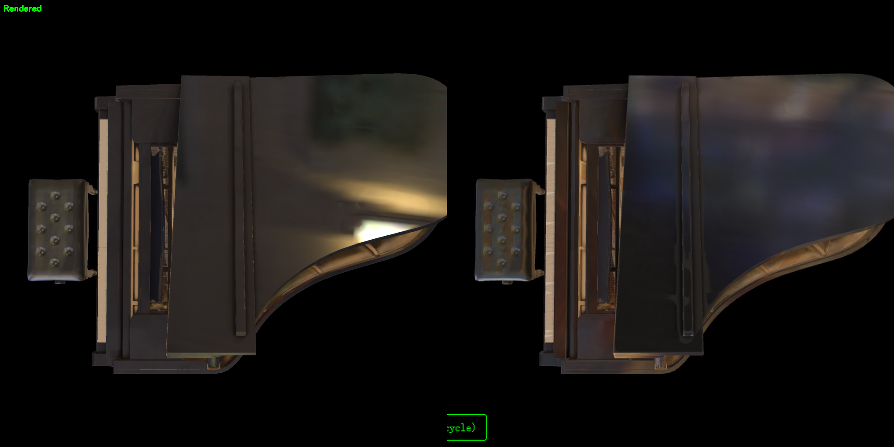
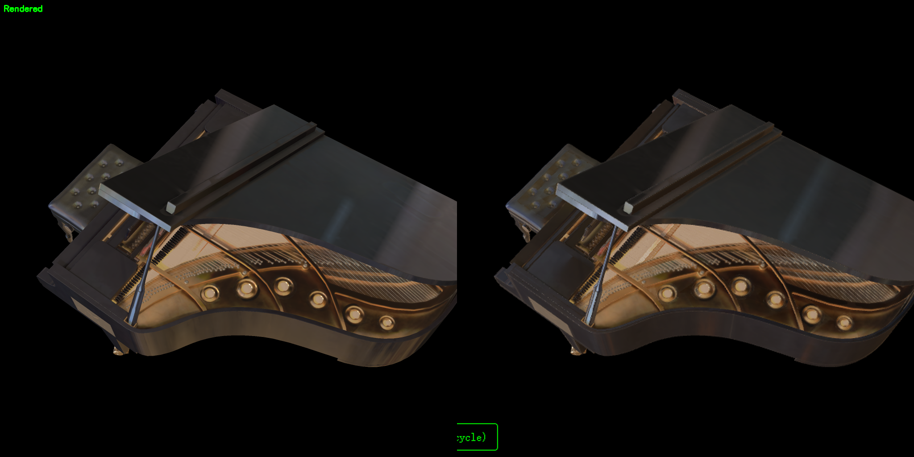
</p>

<p align="center">
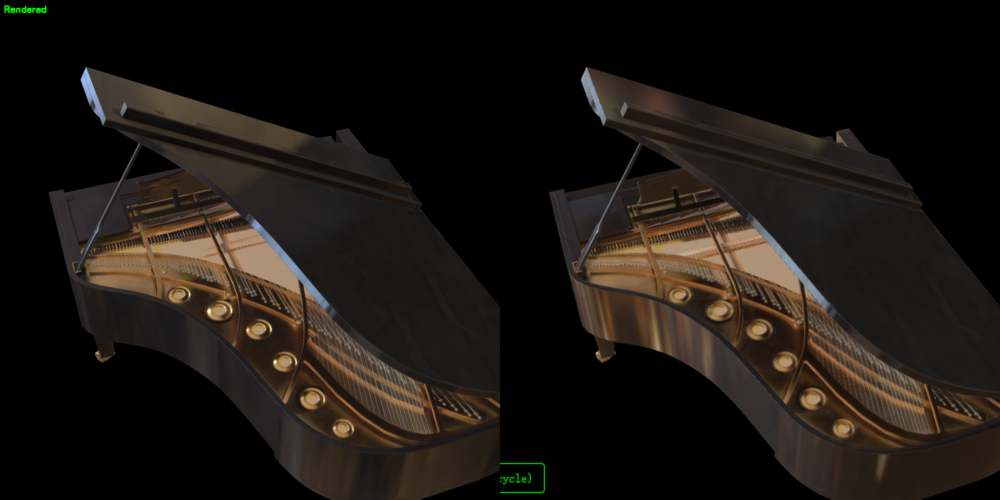
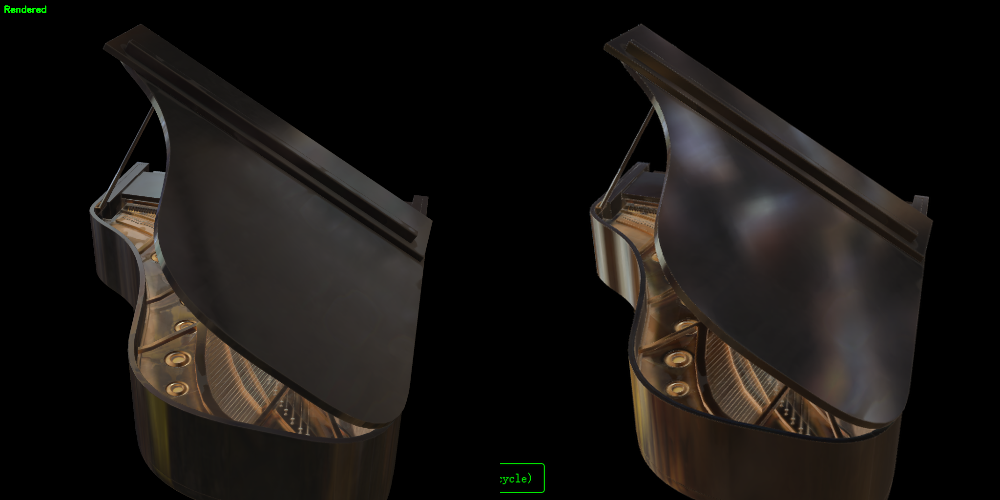
</p>

## 通道分解对比

Web 的 diffuse/specular debug 通道输出**线性值**，GT 面板经过 `pow(1/2.2)` 编码（`pbr_logger.py:162`）。下方对比图 Web 通道已应用相同 `pow(1/2.2)` 编码以视觉对齐。

### Diffuse 通道

<p align="center">
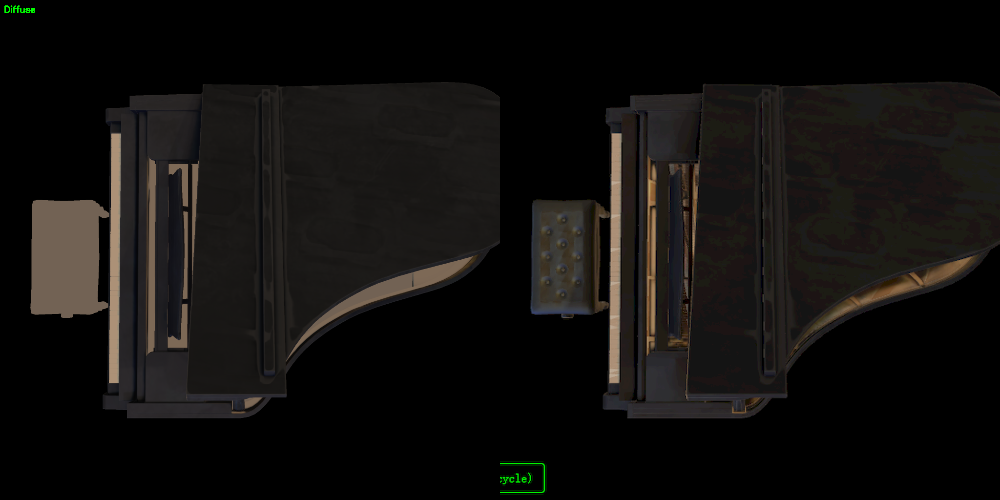
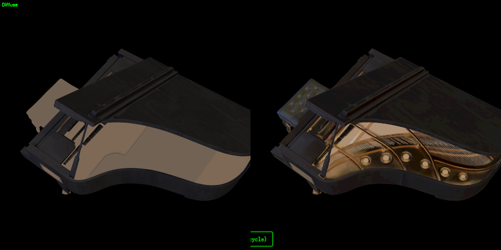
</p>

<p align="center">
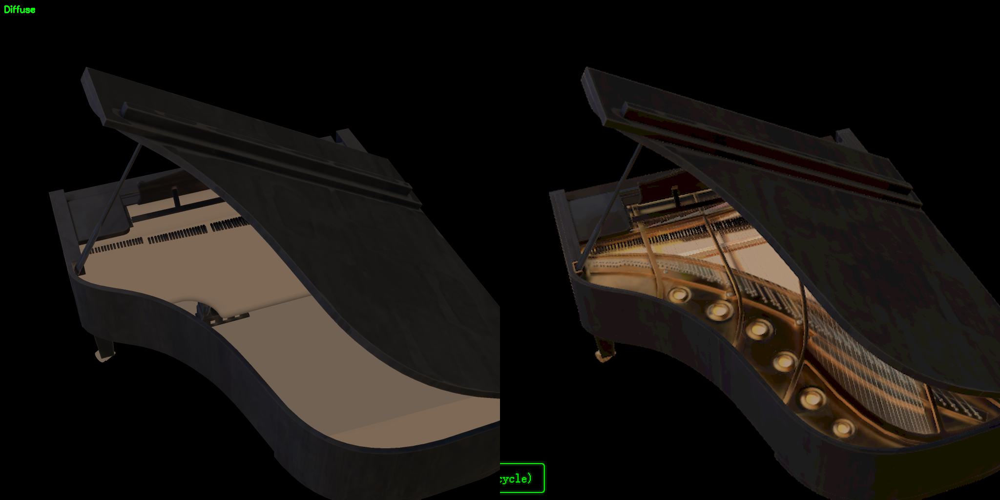
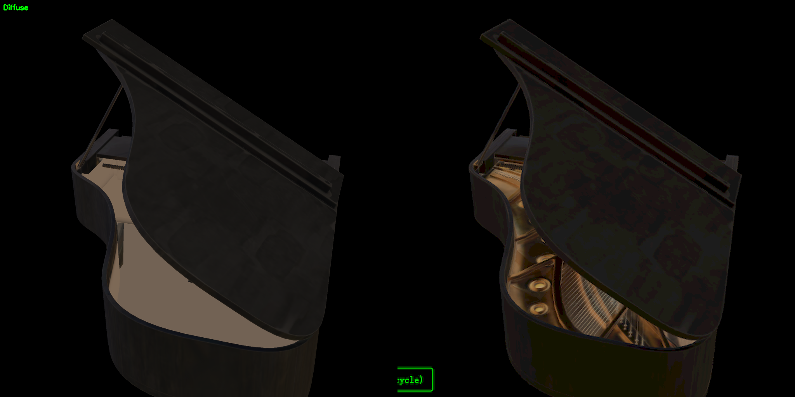
</p>

### Specular 通道

<p align="center">
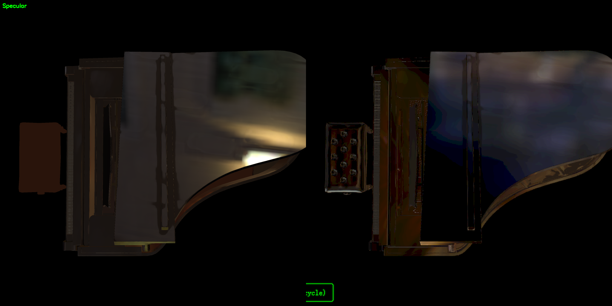
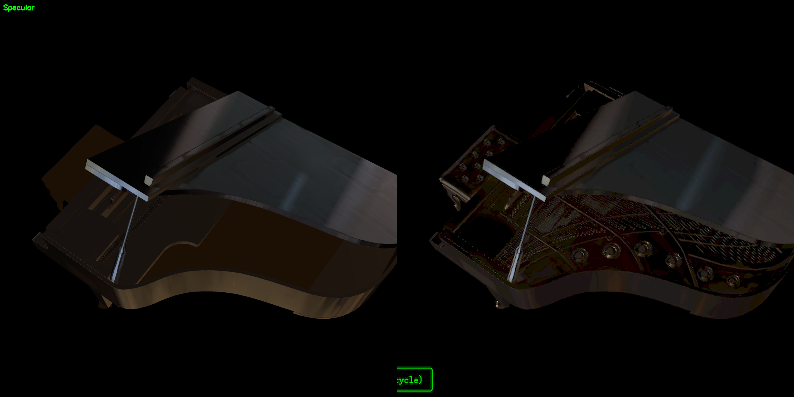
</p>

<p align="center">
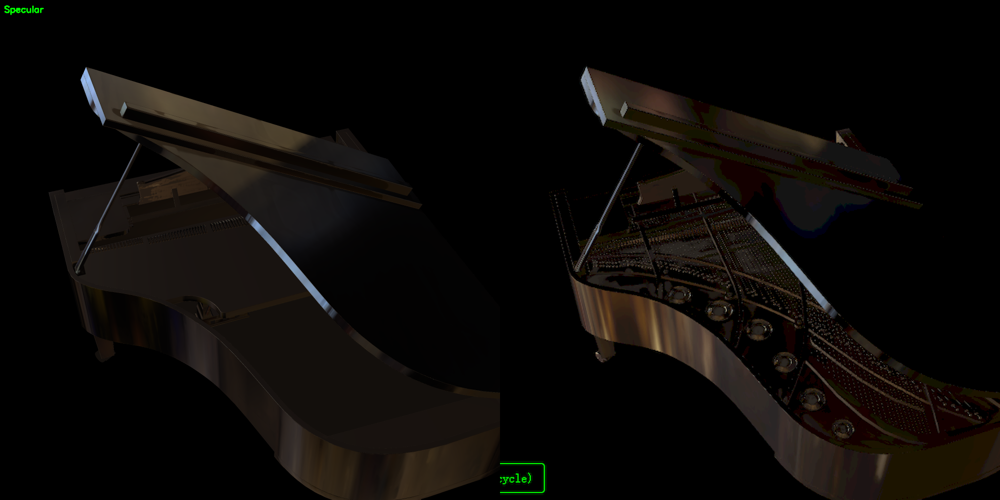
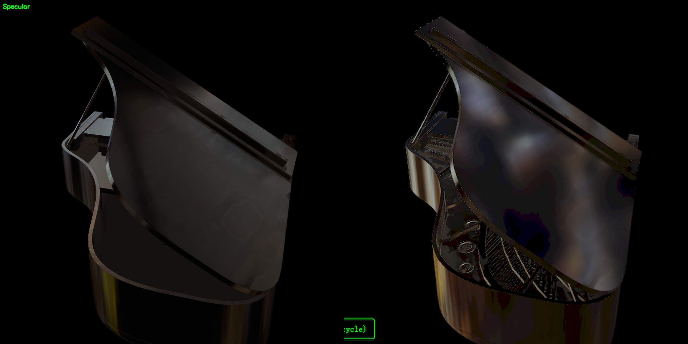
</p>

## 分析

### 已对齐

- 4 个角度相机参数、剪影、取景全部对齐（重叠率 30%+）
- 琴键：Web 与 GT 都是白键白、黑键黑，纹理映射正确
- 共鸣板：基色（暖 tan 木纹）方向一致
- 金属琴架/调音钉：金色金属质感一致
- Diffuse 通道方向一致（修复 irradiance mip 后），亮度和色温差异在可接受范围

### 剩余误差来源

1. **共鸣板色温略偏**：Web 比 GT 稍偏黄/欠饱和。可能与 env map prefiltered specular 的 LOD 采样方式有关（见 README 遗留问题第 1 条），或与 baseColor gamma 曲线细微差异（README 第 3 条）有关。视觉上不显著，PSNR 影响较大。
2. **离屏渲染路径不可靠**：本报告的 PSNR 用 viewport 中心方图裁剪 + resize 估算，并非严格 1024×1024 像素对比。亚像素几何错位和 resize 插值会拉低 PSNR。
3. **亚像素几何错位**：nvdiffrast 与 WebGL 光栅化在 silhouette 覆盖判断上有差异，边缘 1–2 像素带贡献 50–100 RGB 偏差。

## 结论

| 项目 | 状态 |
|------|------|
| 视觉对齐（取景/剪影/琴键/共鸣板/金属架） | 通过 |
| 整体色调（修复 irradiance mip 后） | 通过 |
| 4 个相机角度 PSNR | 18.48 / 25.99 / 24.31 / 19.58 dB |
| PSNR ≥ 30 dB | 未达（最高 25.99 dB） |

未达 ≥30 dB 目标的主因：(1) 离屏渲染不一致导致用 viewport 估算 PSNR；(2) specular LOD 语义不一致（与 helmet 共因，见 README 遗留问题）；(3) 共鸣板色温轻微偏差。

## 复现步骤

```bash
# 1. 从 no_normal 输出打包 piano
python -m scripts.package_runtime_asset \
  --glb data/piano_260604/scene/original_with_mats.glb \
  --epoch-dir output/piano_no_normal/epoch2000 \
  --scene-name piano

# 2. 启动 dev server
cd app && npm install && npm run dev

# 3. 加载 piano 场景 + cam50 hash
#    http://localhost:5173/#cam=3.664963,3.423182,9.607039,0.196580,0.959404,2.287011,0.0,0.0,1.0,40.2

# 4. 提取 GT 面板
python scripts/extract_gt_panels.py --scene piano --out-dir app/resource/piano_no_normal_ab

# 5. 在浏览器中采集 4 相机 × 3 通道（final/diffuse/specular）截图，
#    保存为 app/resource/piano_no_normal_ab/{web,diffuse_web,specular_web}_cam{0,50,100,150}.png
#    （可参考 scripts/gen_ab_compare_images.py 顶部的预期文件名）

# 6. 生成对比图 + PSNR
python scripts/gen_ab_compare_images.py --scene piano
```

## 相关文件

- 资源：`app/resource/piano_no_normal_ab/`
- 数据源：`output/piano_no_normal/epoch2000/`
- 训练配置：`configs/train_pbr_piano_multi_no_normal.yaml`
- 打包脚本：`scripts/package_runtime_asset.py`
- GT 提取脚本：`scripts/extract_gt_panels.py`
- 对比图生成脚本：`scripts/gen_ab_compare_images.py`
