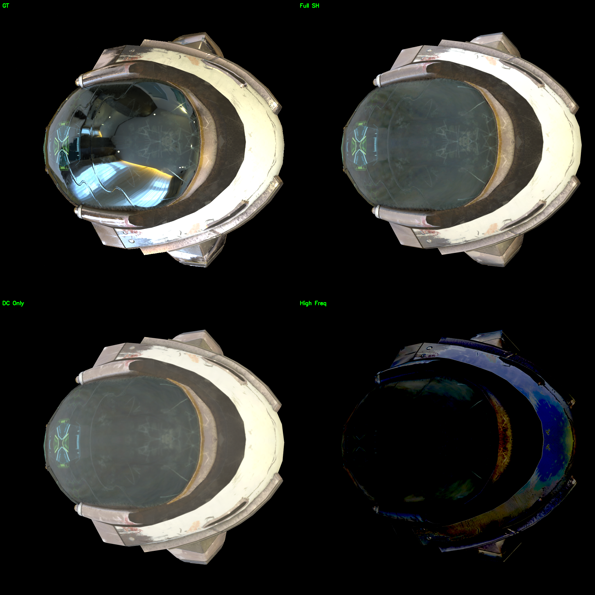
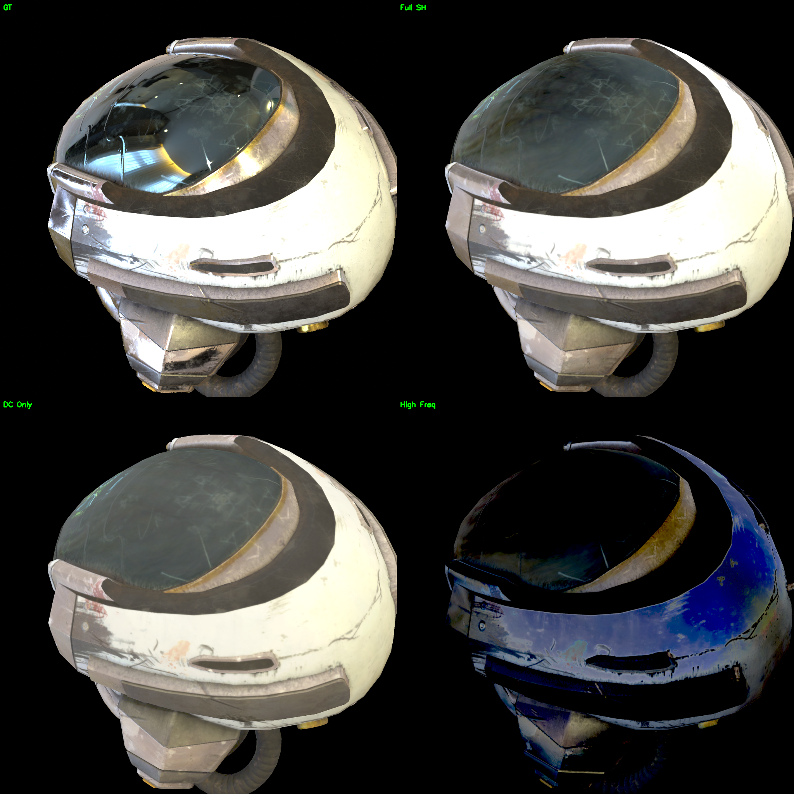
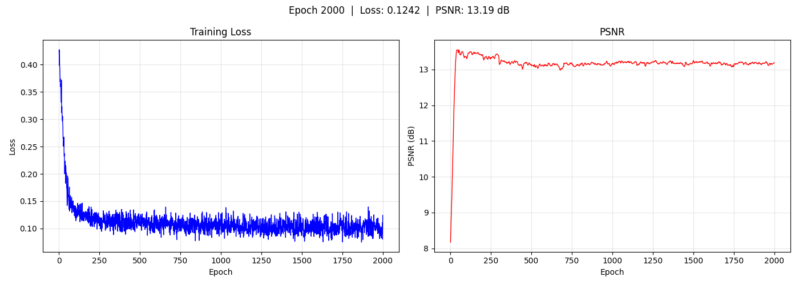

# Helmet — SH Rendering

DamagedHelmet 头盔场景，使用 2 阶球谐系数（SH）着色。

## 实验配置

| 参数 | 值 |
|------|-----|
| 着色模型 | SH (order 2) |
| 网格 | `data/helmet_260604/scene/lowpoly.glb` |
| 纹理分辨率 | 512 → 1024 → 2048 → 4096 |
| 训练轮数 | 2000 |
| 输出 | `output/helmet_260604/` |

## 结果

| 指标 | 值 |
|------|-----|
| **PSNR** | **13.19 dB** |

## 渲染对比

左上 GT，右上渲染，左下 Diffuse（DC），右下高频分量（高阶 SH）。

## 训练曲线

## 优化纹理（Diffuse / DC）

SH 模型学习到的 DC（diffuse）纹理：

## 环绕视频

Full / DC-only / High-frequency 分量：

[▶ orbit](../../resource/helmet_sh/orbit.mp4) &nbsp; [▶ orbit_dc](../../resource/helmet_sh/orbit_dc.mp4) &nbsp; [▶ orbit_hf](../../resource/helmet_sh/orbit_hf.mp4)

## 分析

SH PSNR 仅 13.19 dB。2 阶 SH 只有 9 个基函数，无法逼近头盔金属面罩的锐利镜面高光。面罩需要高动态范围的 specular response，SH 的基函数数量不足以表达。

SH 更适合漫反射为主的场景（如钢琴 20.37 dB），对 specular-heavy 场景效果差。

## 相关文件

- 资源：`resource/helmet_sh/`
- 输出：`output/helmet_260604/epoch2000/`
