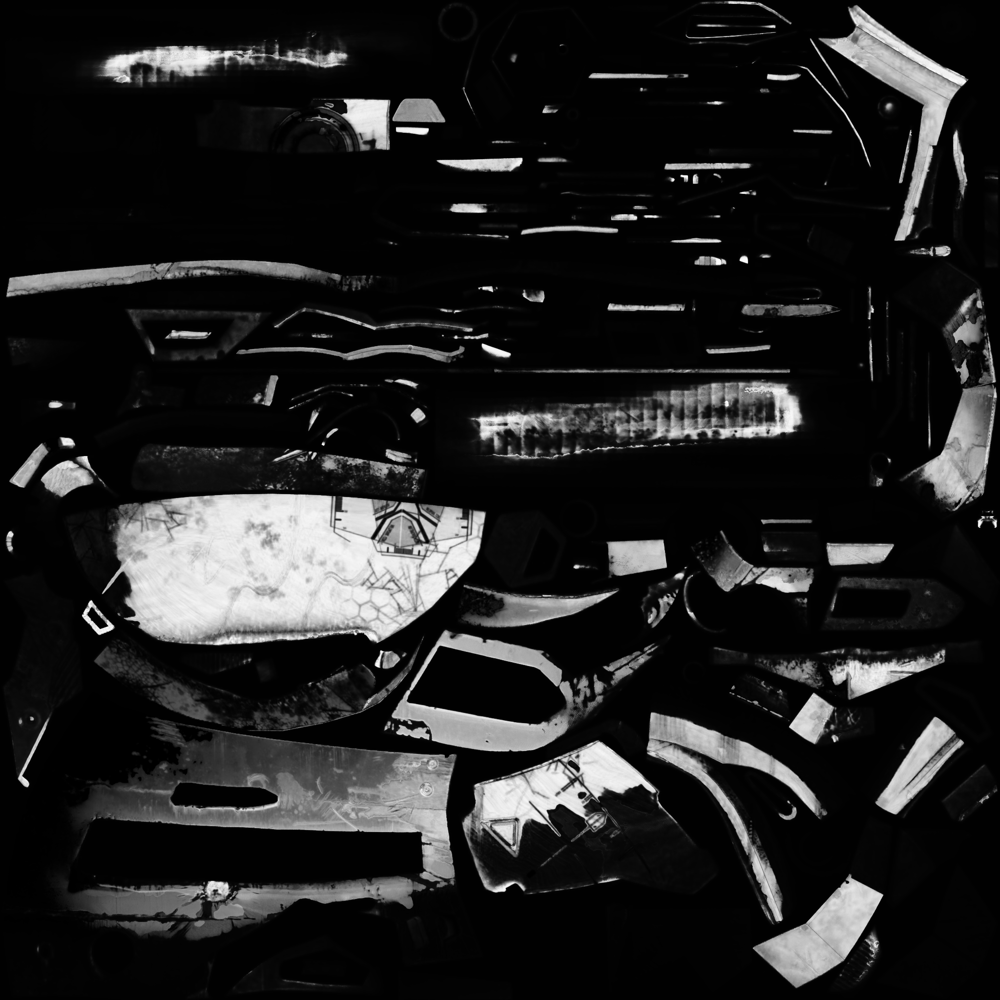

# 02 — PBR Split-Sum Rendering Scheme

基于 GGX 微表面 BRDF 和 split-sum 近似的可微 PBR 方案。显式分离材质参数（base_color、roughness、metallic、法线贴图）和环境光照（HDR 环境贴图），实现物理正确的镜面高光和材质相关的反射。

## 技术参数

| 参数 | 值 |
|------|-----|
| 材质纹理 | 8 通道（base_color 3 + roughness 1 + metallic 1 + normal 3） |
| 材质编码 | sigmoid（ch 0-4）+ normalize（ch 5-7） |
| 环境贴图 | 256×512 HDR，softplus 编码 |
| BRDF LUT | 256×256，预计算 GGX split-sum |
| 纹理分辨率 | 512 → 1024 → 2048（Coarse-to-Fine） |
| Batch Size | 4 |
| 损失函数 | L1 + SSIM + TV（纹理）+ TV + L2（env map） |

## 与 SH 对比

| 场景 | SH | PBR | 提升 |
|------|-----|-----|------|
| 头盔 | 13.19 dB | **21.97 dB** | **+8.78 dB** |
| 钢琴 | 20.37 dB | **21.41 dB** | +1.04 dB |

PBR 在头盔上大幅提升因为 split-sum GGX BRDF 正确处理了金属/光洁表面的镜面高光。钢琴以漫反射为主，提升有限。

## 管线架构

```
Material Texture (8ch)          Environment Map (HDR)
        │                              │
┌───────┴───────┐              ┌───────┴───────┐
│ base_color    │              │ Irradiance    │
│ roughness ────┼── GGX ──────┤ Prefiltered   │
│ metallic      │   BRDF       │ Environment   │
│ normal_map    │   + LUT      │               │
└───────────────┘              └───────────────┘
        │                              │
        └──────────┬───────────────────┘
                   │
              Split-Sum 着色
              (diffuse + specular)
```

## 上限诊断（头盔）

| 实验 | PSNR |
|------|------|
| Random init PBR（baseline） | 21.97 dB |
| GT 材质 + EXR 环境光初始化 | 22.17 dB |
| **差距** | **+0.20 dB** |

使用 DamagedHelmet 原始材质（albedo / metallicRoughness / normal，2048×2048）+ 场景 EXR 初始化环境贴图，仅提升 +0.20 dB。说明：**~22 dB 是 split-sum 着色模型的上限，材质优化不是瓶颈。**

Tone mapping 实验（Filmic/ACES、Reinhard、log1p）全部降低 PSNR，原版 softplus+clamp 管线最优。

## 头盔材质贴图样例

<p align="center">




</p>

学习到的环境贴图：

<p align="center">

</p>

BRDF LUT：

<p align="center">

</p>

## 局限

1. **无全局光照**——single-bounce split-sum 无法捕捉间接光照
2. **无阴影**——环境光遮蔽和自阴影缺失
3. **仅环境光照**——无点光源/方向光支持
4. **粗糙度初始化敏感**——从 0.5 开始对光滑表面收敛慢

## 相关文件

- 输出：`output/helmet_260604_pbr/`，`output/piano_260604_pbr/`
- 资源：`resource/helmet_pbr/`，`resource/piano_pbr/`
