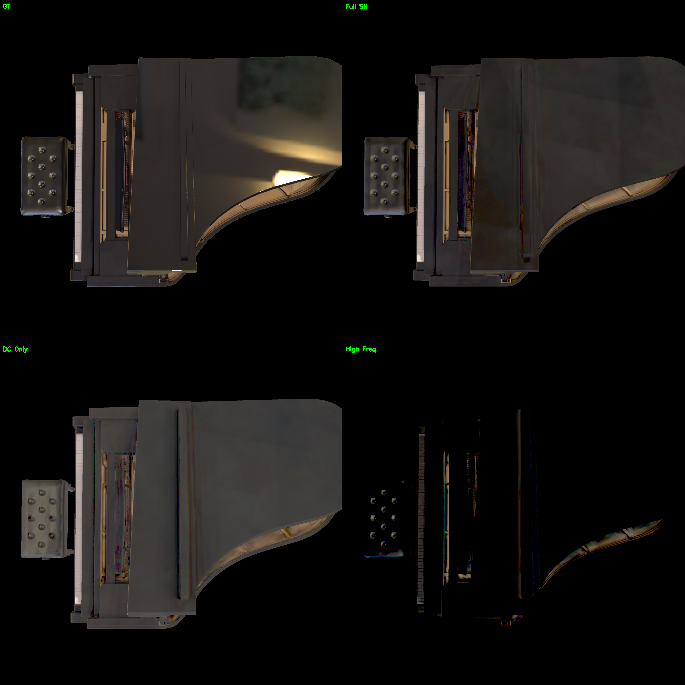
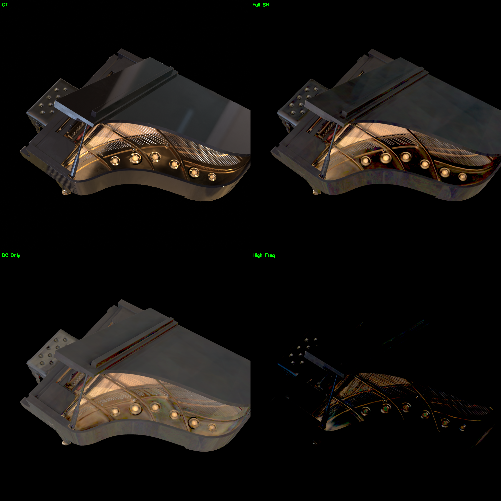
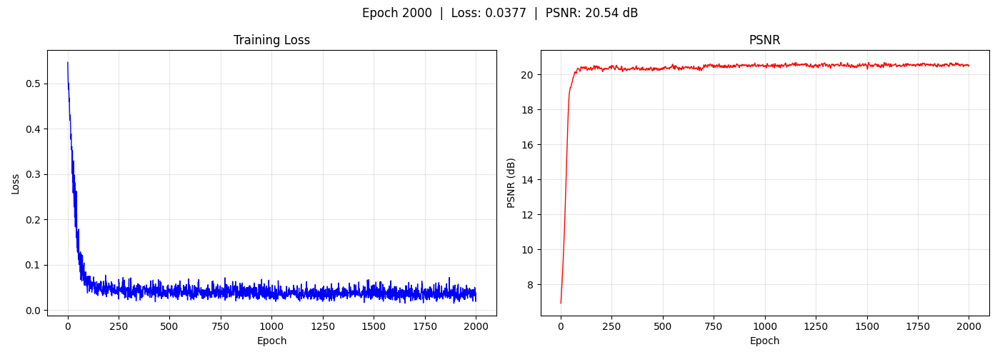

# Piano — SH Rendering

钢琴场景，使用 2 阶球谐系数（SH）着色。

## 实验配置

| 参数 | 值 |
|------|-----|
| 着色模型 | SH (order 2) |
| 网格 | `data/piano_260604/scene/lowpoly.glb` |
| 纹理分辨率 | 512 → 1024 → 2048 → 4096 |
| 训练轮数 | 2000 |
| 输出 | `output/piano_260604/` |

## 结果

| 指标 | 值 |
|------|-----|
| **PSNR** | **20.37 dB** |

## 渲染对比

左上 GT，右上渲染，左下 Diffuse（DC），右下高频分量（高阶 SH）。

## 训练曲线

## 环绕视频

<video src="../../resource/piano_sh/orbit.mp4" width="30%"/>
<video src="../../resource/piano_sh/orbit_dc.mp4" width="30%"/>
<video src="../../resource/piano_sh/orbit_hf.mp4" width="30%"/>

## 分析

钢琴 PSNR 20.37 dB，远高于头盔的 13.19 dB。钢琴以暗色漫反射为主，2 阶 SH 近似尚可。深色木质琴身的大面积均匀区域容易用低阶基函数表达。

但三角面走样较为明显（单张纹理共享 UV 空间导致），且缺乏精细的材质控制。

## 相关文件

- 资源：`resource/piano_sh/`
- 输出：`output/piano_260604/epoch2000/`
