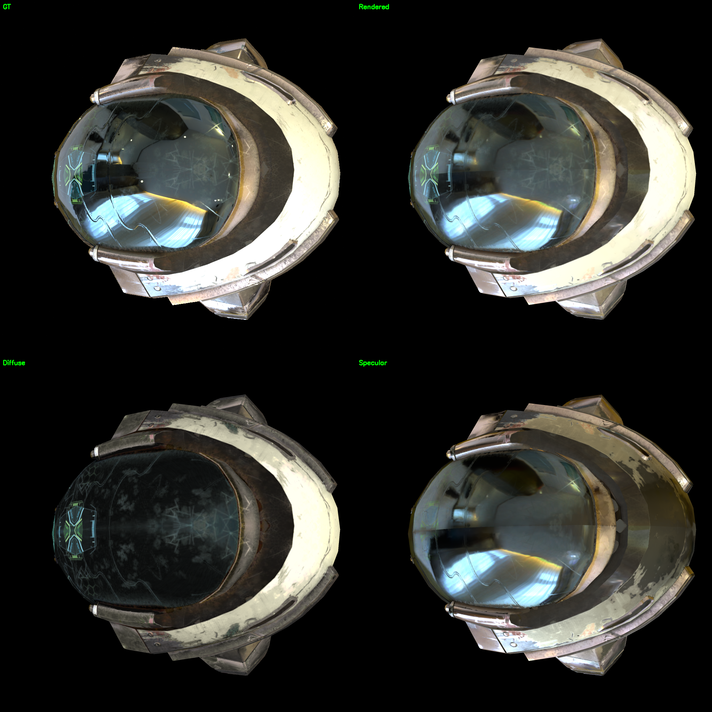
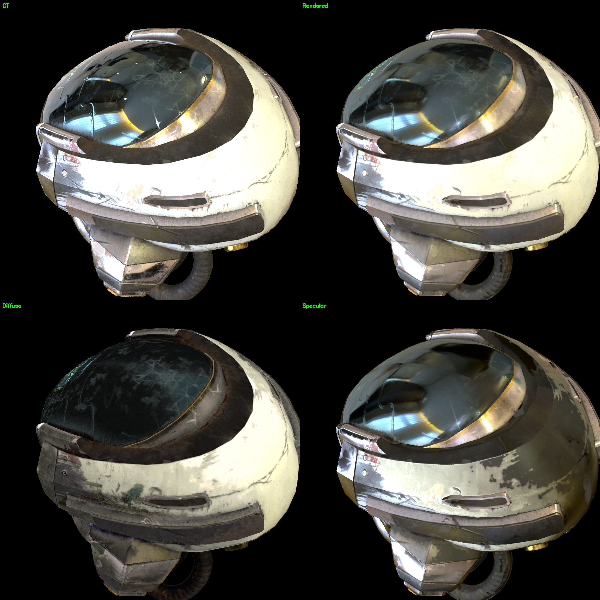
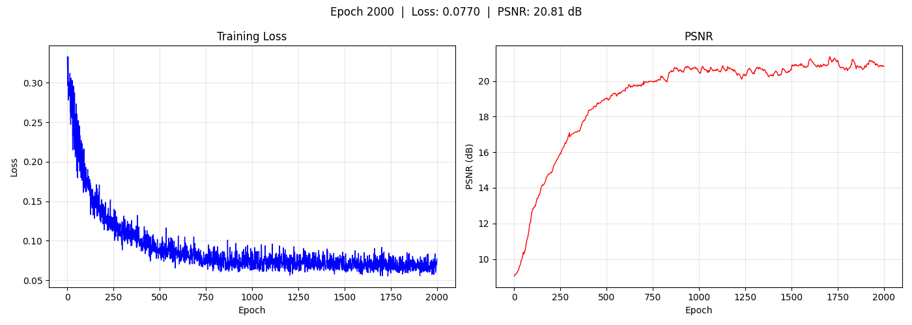
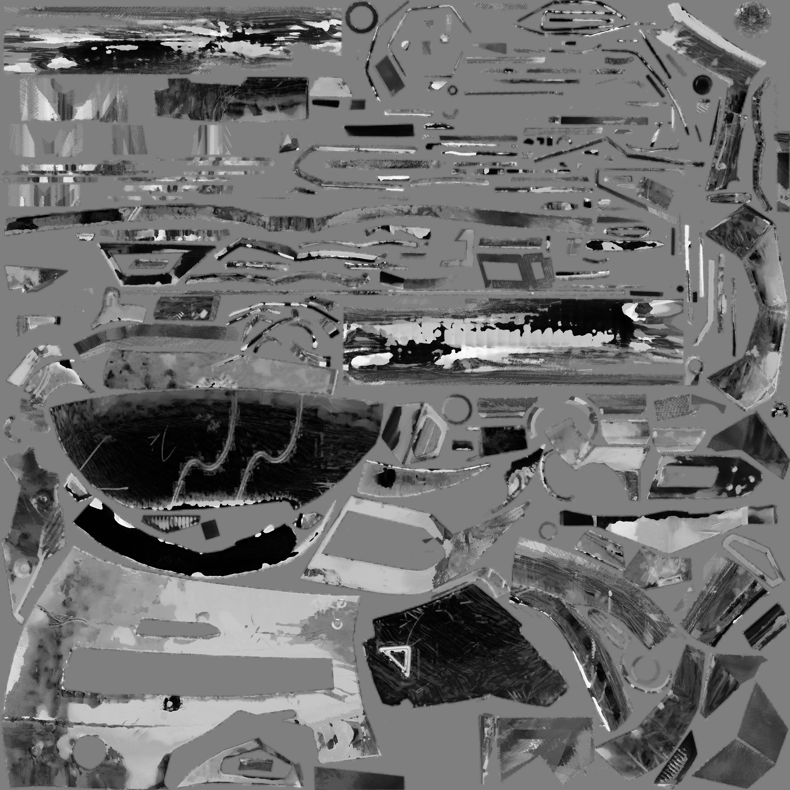
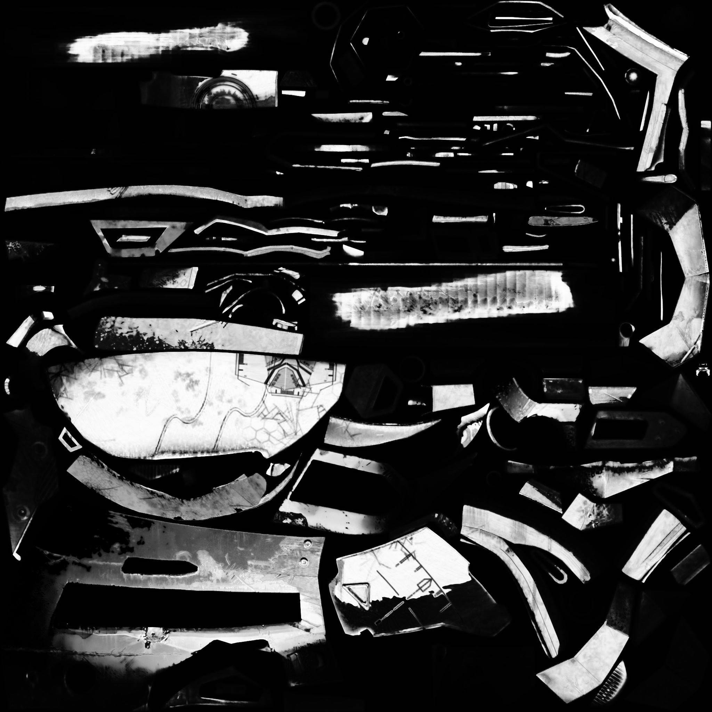
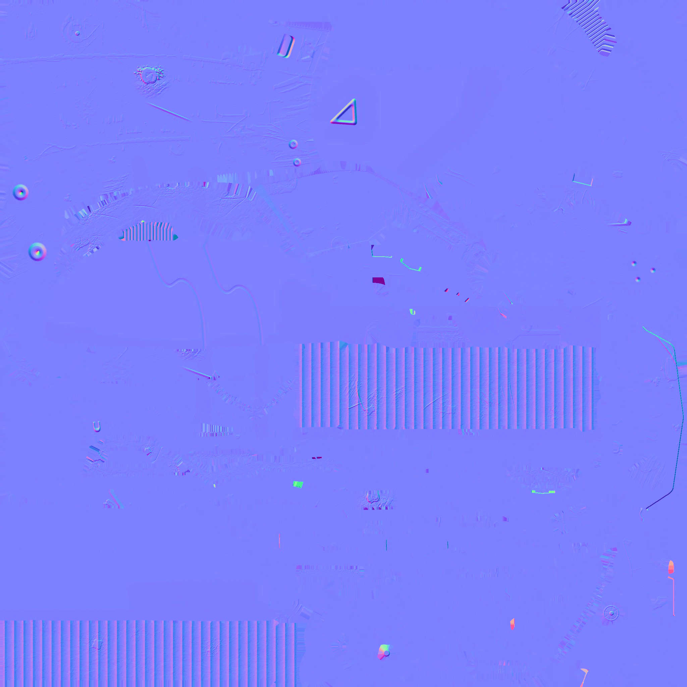
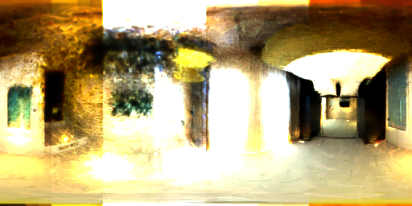
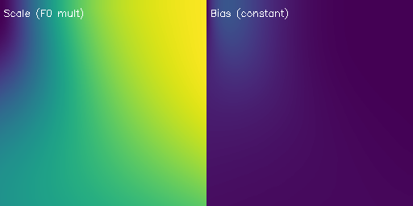

# Helmet — PBR Split-Sum Rendering (Frozen Normal)

DamagedHelmet 头盔场景，使用 PBR split-sum 着色 + 外部法线贴图冻结。金属面罩 + 衬垫，测试 specular/reflection 处理能力。

## 改进要点

与上一版（normal map 优化，PSNR 21.97 dB）相比，本版将外部 GT 法线贴图烘焙进 normal 通道并冻结，训练中不优化法线：

- 消除了法线贴图优化产生的噪声和高光"水渍感"
- 使用 `data/helmet_260604/scene/gt_textures/Default_normal.jpg`（517KB）替代 GLB 内嵌占位图（645 字节）
- 梯度累积逐 submesh 训练，VRAM 从 14.8GB 降至 6.3GB

## 实验配置

| 参数 | 值 |
|------|-----|
| 着色模型 | PBR (GGX split-sum) |
| 网格 | `data/helmet_260604/scene/lowpoly.glb`（14,588 顶点） |
| 材质纹理 | 8 通道（base_color 3 + roughness 1 + metallic 1 + normal 3） |
| 法线贴图 | 外部 GT 法线贴图，烘焙后冻结 |
| 环境贴图 | 256×512 HDR（softplus 编码） |
| 纹理分辨率 | 512 → 1024 → 2048 |
| 训练轮数 | 2000 |
| 输出 | `output/helmet_no_normal/` |

## 结果

| 指标 | 值 |
|------|-----|
| **PSNR** | **20.81 dB** |
| 对比 SH | **+7.62 dB** |
| 对比旧 PBR（优化法线） | -1.16 dB |

> PSNR 略低于旧版（21.97 dB），但视觉质量显著改善。旧版优化法线导致高频噪声和"水渍"高光伪影，冻结法线消除了这些伪影，材质分解更干净。

## 渲染对比

左上 GT，右上渲染，左下 Diffuse，右下 Specular。

## 训练曲线

## 材质分解

- **base_color**：面罩划痕和磨损细节清晰
- **roughness**：面罩低粗糙度、衬垫高粗糙度，分区明确
- **metallic**：面罩高金属度、衬垫低，边界锐利无噪声
- **normal_map**：外部 GT 法线贴图，冻结未优化

## 环境贴图 & BRDF LUT

## 环绕视频

[▶ orbit](../../resource/helmet_pbr_v2/orbit.mp4) &nbsp; [▶ orbit_diffuse](../../resource/helmet_pbr_v2/orbit_diffuse.mp4) &nbsp; [▶ orbit_specular](../../resource/helmet_pbr_v2/orbit_specular.mp4)

## 训练过程

| Epoch | PSNR | Resolution |
|-------|------|------------|
| 1 | ~10 dB | 512 |
| 200 | ~17 dB | 512 |
| 400 | ~19 dB | 1024 |
| 800 | ~20 dB | 2048 |
| 2000 | **20.81 dB** | 2048 |

## 分析

冻结法线使 PSNR 下降 1.16 dB，但换来两个关键改进：
1. **消除"水渍"伪影**：法线优化时 normalize 在 (0,0,1) 附近梯度退化，导致法线噪声 → 反射方向抖动 → 高光斑块
2. **材质分解质量**：roughness/metallic 贴图更干净，没有法线噪声传播到其他通道

PSNR 下降的原因是 GT 法线贴图产生的尖锐反射在 split-sum 近似下无法完全匹配 Cycles path tracing 的结果（split-sum 无 GI、无阴影、无多次弹射），而旧版噪声法线恰好模糊了高光匹配了 GT。

## 相关文件

- 资源：`resource/helmet_pbr_v2/`
- 输出：`output/helmet_no_normal/epoch2000/`
- 配置：`configs/train_pbr_helmet_no_normal.yaml`
