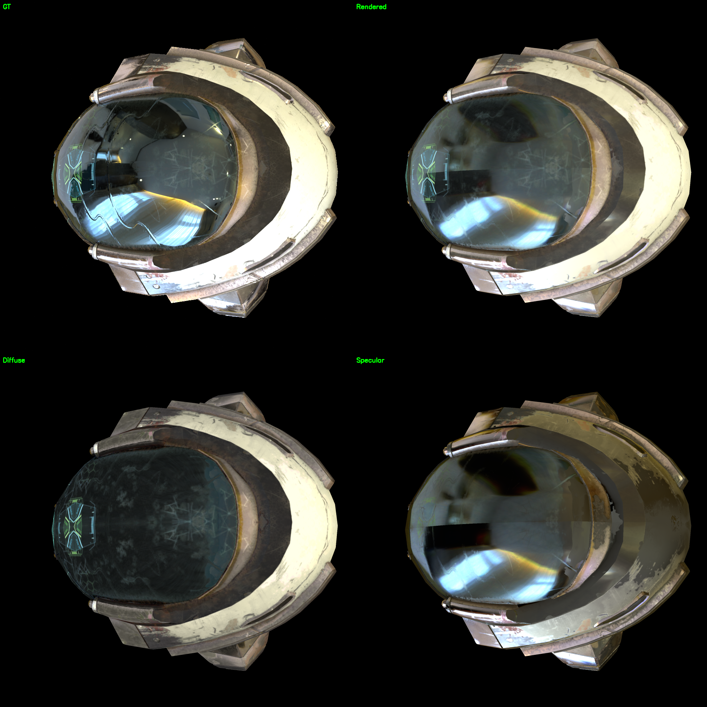
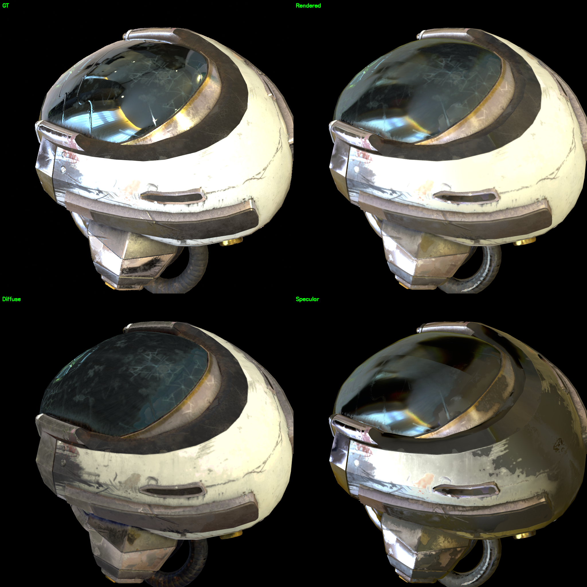
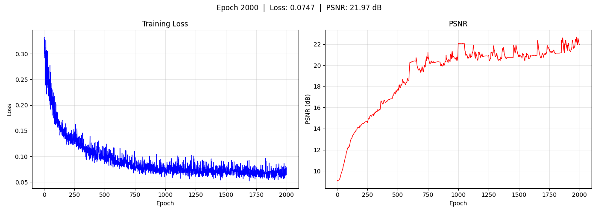

# 03 — Helmet Scene (DamagedHelmet)

Khronos glTF 示例模型。单个 mesh（14,588 顶点，15,452 面），金属面罩 + 衬垫。测试镜面反射/高光处理能力的标准场景。

## 结果对比

| 方案 | PSNR | 纹理分辨率 | 分析 |
|------|------|-----------|------|
| SH | 13.19 dB | 4096 | 无法捕捉高光 |
| **PBR** | **21.97 dB** | **2048** | GGX BRDF + envmap 正确处理 |
| GT init PBR | 22.17 dB | — | Split-sum 上限 |

## 渲染对比

_左上 GT，右上渲染，左下 Diffuse，右下 Specular_

## 训练曲线

## 训练过程

| Epoch | PSNR | Resolution |
|-------|------|------------|
| 1 | ~10 dB | 512 |
| 200 | ~18 dB | 512 |
| 400 | ~19 dB | 1024 |
| 800 | ~21 dB | 2048 |
| 2000 | **21.97 dB** | 2048 |

## 环绕视频

<video src="../../resource/helmet_pbr/orbit.mp4" width="30%"/>
<video src="../../resource/helmet_pbr/orbit_diffuse.mp4" width="30%"/>
<video src="../../resource/helmet_pbr/orbit_specular.mp4" width="30%"/>

## 材质分解

- **base_color**：学习了面罩划痕细节
- **roughness**：面罩低粗糙度，衬垫高粗糙度
- **metallic**：面罩高金属度，衬垫低金属度
- **normal_map**：细微表面起伏

## 环境贴图

## 关键发现

1. **PBR 比 SH 提升 +8.8 dB**——split-sum GGX BRDF 通过 roughness 控制 specular lobe 宽度，2 阶 SH 无法逼近尖锐反射
2. **~22 dB 是 split-sum 上限**——即使用 GT 材质和 EXR 环境光初始化也只有 +0.20 dB
3. **Tone mapping 全部失败**——Filmic/ACES、Reinhard、log1p 均降低 PSNR
4. **面罩高光略软**——学习到的环境贴图可能 HDR 动态范围不足

## 相关文件

- 输出：`output/helmet_260604_pbr/epoch2000/`
- 资源：`resource/helmet_pbr/`
