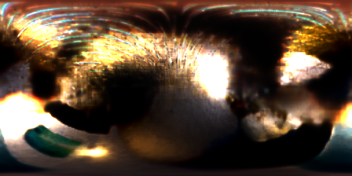

# Piano — PBR Split-Sum (Single-Mesh)

钢琴场景，使用 PBR split-sum 单 mesh 方案。所有子部件（琴身、琴键、琴弦、踏板）共享一张 2048×2048 的 8 通道材质纹理。

## 实验配置

| 参数 | 值 |
|------|-----|
| 着色模型 | PBR (GGX split-sum) |
| 网格 | `data/piano_260604/scene/lowpoly.glb`（~14K 顶点） |
| 纹理方案 | 单张共享 8 通道纹理 |
| 纹理分辨率 | 512 → 1024 → 2048 |
| 训练轮数 | 2000 |
| 输出 | `output/piano_260604_pbr/` |

## 结果

| 指标 | 值 |
|------|-----|
| **PSNR** | **21.41 dB** |
| 对比 SH | **+1.04 dB** |

## 渲染对比

左上 GT，右上渲染，左下 Diffuse，右下 Specular。

## 训练曲线

## 材质分解

## 环境贴图

## 环绕视频

<video src="../../resource/piano_pbr/orbit.mp4" width="30%"/>
<video src="../../resource/piano_pbr/orbit_diffuse.mp4" width="30%"/>
<video src="../../resource/piano_pbr/orbit_specular.mp4" width="30%"/>

## 训练过程

| Epoch | PSNR | Resolution |
|-------|------|------------|
| 1 | ~12 dB | 512 |
| 400 | ~19 dB | 1024 |
| 1000 | ~21 dB | 2048 |
| 2000 | **21.41 dB** | 2048 |

## 问题

### 三角形走样
所有 UV 岛共享一张纹理，不同材质区域在 UV 接缝处产生明显三角形走样。多材质物体使用单纹理的主要局限。

### 材质平均化
一张纹理无法表达钢琴不同部件的材质差异：
- 琴键白色 vs 琴身黑色亮漆 vs 琴弦金属
- 各部件只能折中，每部分都 sub-optimal

### UV 空间竞争
大面板获得高 texel 密度，小部件（琴键/琴弦）密度低。

## 与 Multi-Mesh 对比

| 方面 | Single-Mesh | Multi-Mesh |
|------|------------|------------|
| PSNR | 21.41 dB @ 2048 | **21.95 dB** @ 1024 |
| 三角走样 | 可见 | 无 |
| 部件材质 | 平均化 | 独立 |

## 相关文件

- 资源：`resource/piano_pbr/`
- 输出：`output/piano_260604_pbr/epoch2000/`
