# Piano — PBR Split-Sum (Multi-Mesh, Frozen Normal)

钢琴场景多 mesh PBR 方案。6 个子 mesh 各自拥有独立 1024×1024 的 8 通道材质纹理，法线贴图从 GLB 提取并冻结。使用原始高模几何（`original_with_mats.glb`，~99K 顶点）与 GT 完全对齐。

## 改进要点

与上一版（normal map 优化，峰值 PSNR ~21.95 dB）相比，本版从 GLB 提取已有法线贴图烘焙进 normal 通道并冻结：

- PSNR 从 21.95 dB → **28.80 dB**，提升 **+6.85 dB**
- 消除了法线优化导致的"水渍"高光伪影和 roughness 噪声
- 逐 submesh 梯度累积训练，VRAM 从 14.8GB 降至 6.3GB

## 子 Mesh 结构

| 子 Mesh | 面数 | 描述 | 法线贴图 |
|---------|------|------|---------|
| Object_0 | 62 | 小型组件 | GLB 提取（占位图） |
| Object_1 | 1,428 | 中型组件 | GLB 提取（占位图） |
| Object_2 | 1,800 | 中型组件 | GLB 提取（占位图） |
| Object_3 | 3,800 | 大型组件 | GLB 提取（占位图） |
| Object_4 | 44,351 | 琴身主体 | 无 |
| Object_5 | 47,831 | 琴身/琴盖 | GLB 提取（占位图） |
| **总计** | **~99K 顶点** | 高模原始几何 | |

> GLB 内嵌法线贴图为 250 字节占位图（flat normal），Object_4（琴身主体）无原始法线贴图。所有法线通道冻结，不参与优化。

## 实验配置

| 参数 | 值 |
|------|-----|
| 着色模型 | PBR (GGX split-sum) |
| 网格 | `data/piano_260604/scene/original_with_mats.glb` |
| 纹理方案 | 6 独立 8 通道纹理，各 1024×1024 |
| 法线贴图 | GLB 提取，烘焙后冻结 |
| 纹理分辨率 | 512 → 1024 |
| 训练轮数 | 2000 |
| 梯度累积 | 逐 submesh，等效 batch = 全部 submesh |
| 输出 | `output/piano_no_normal/` |

## 结果

| 指标 | 值 |
|------|-----|
| **PSNR** | **28.80 dB** |
| 对比 SH | **+8.43 dB** |
| 对比旧 PBR Multi（优化法线） | **+6.85 dB** |

## 渲染对比

左上 GT，右上渲染，左下 Diffuse，右下 Specular。

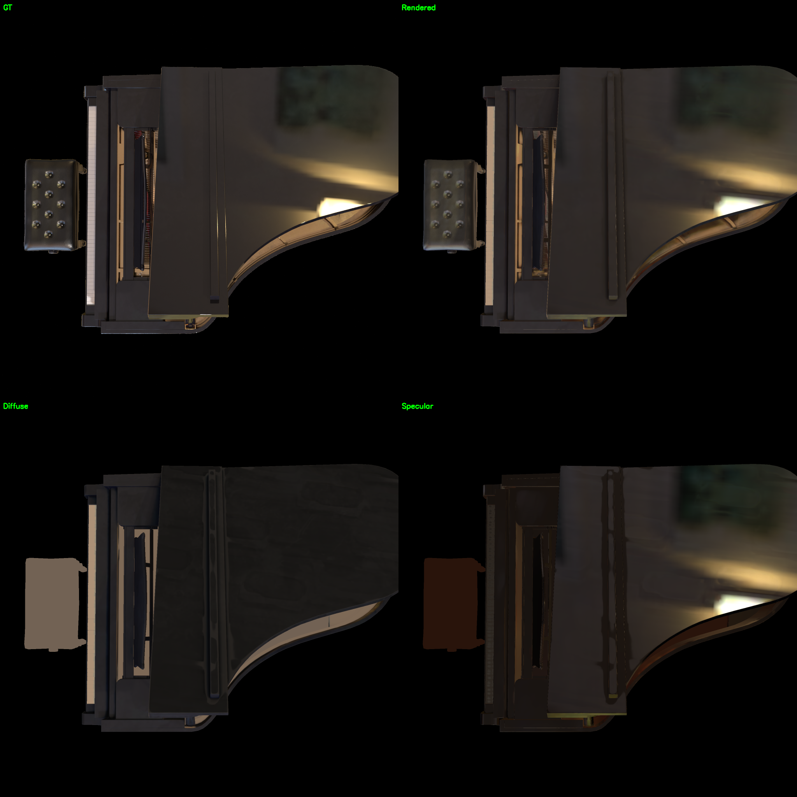
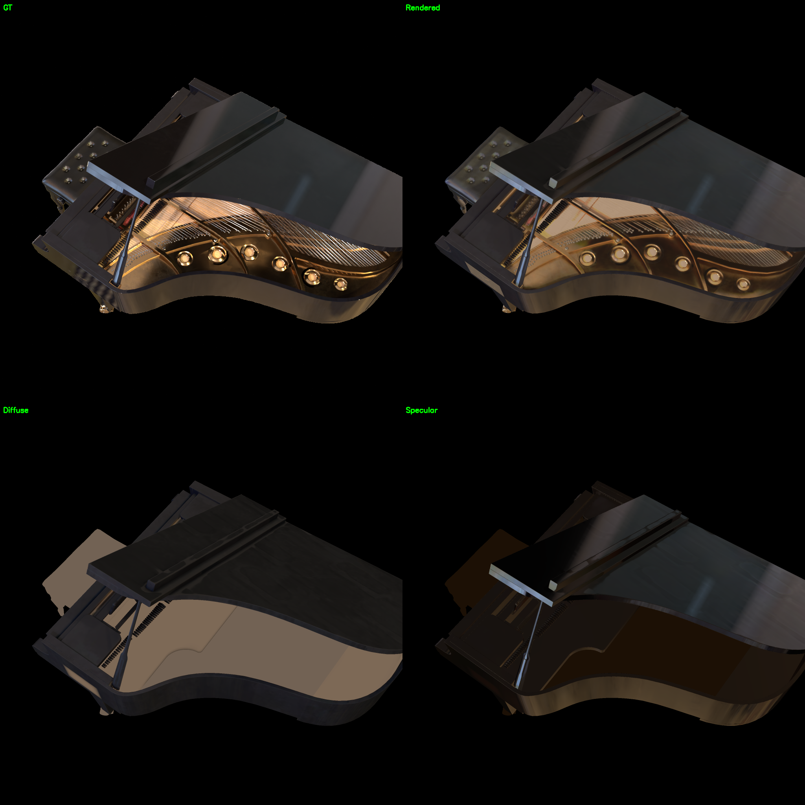

## 训练曲线

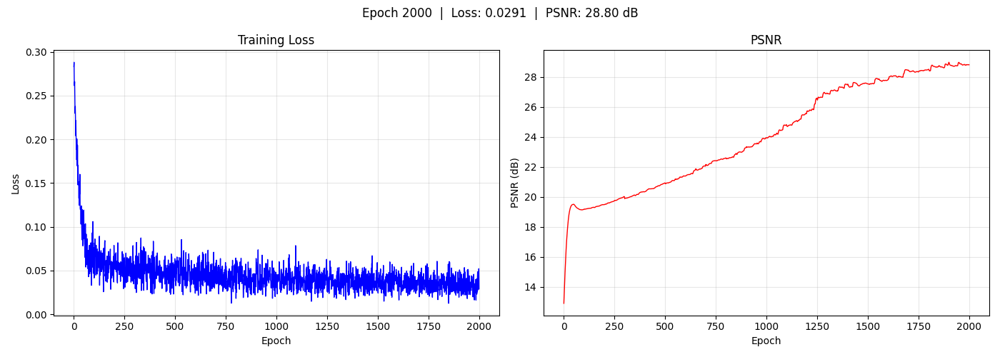

## 子 Mesh 材质 — Object_4（琴身主体，最大子 mesh）

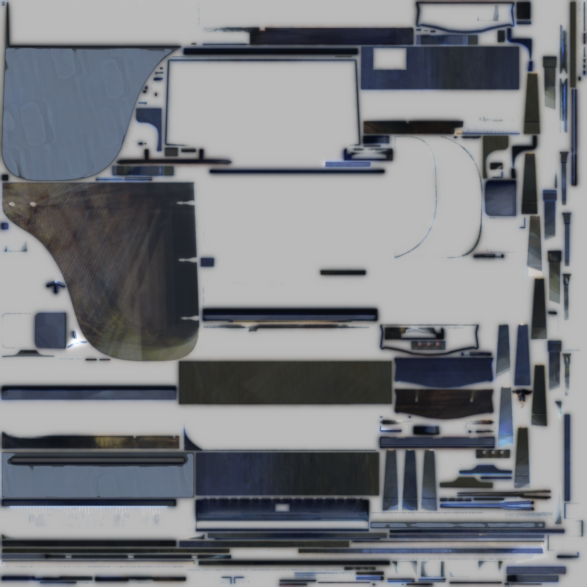
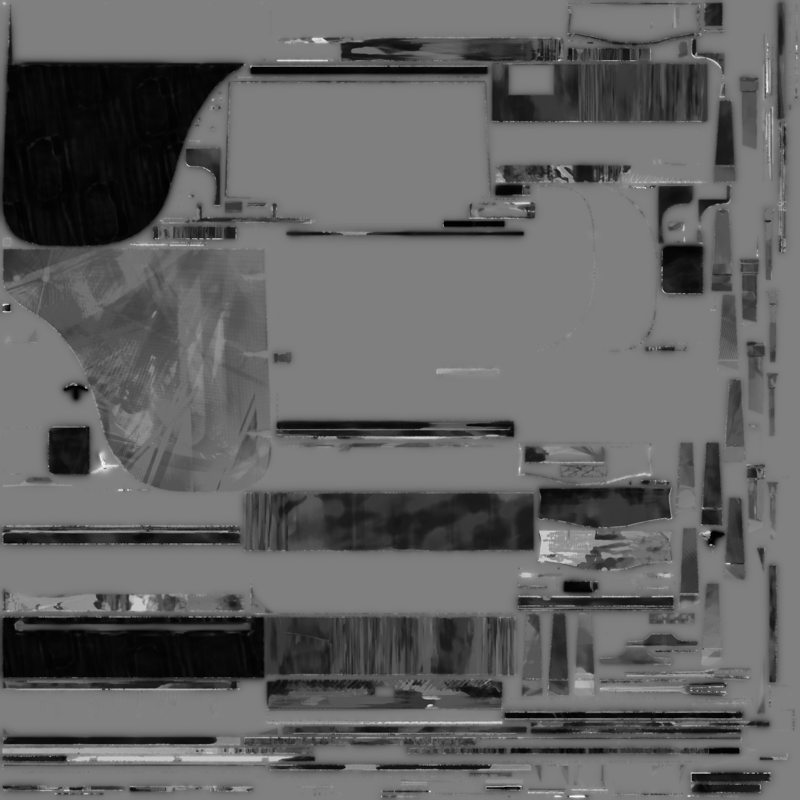
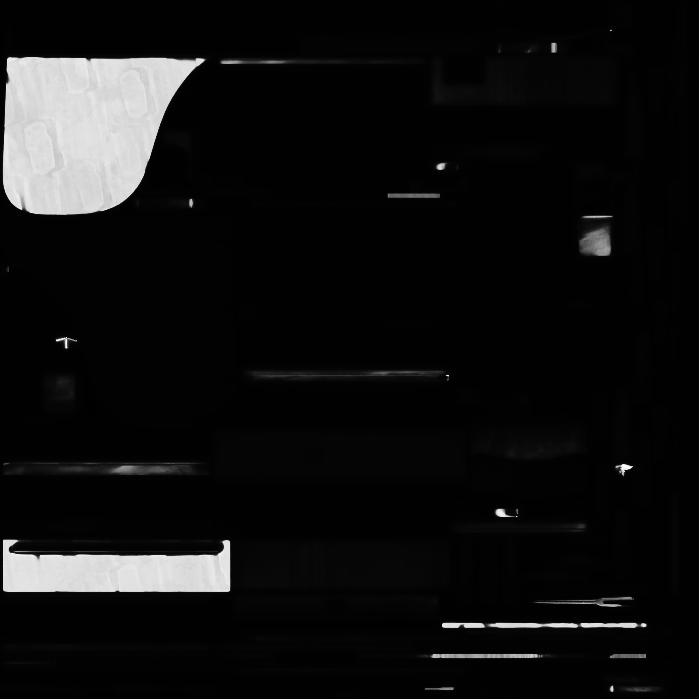

## 子 Mesh 材质 — Object_2（中型组件）

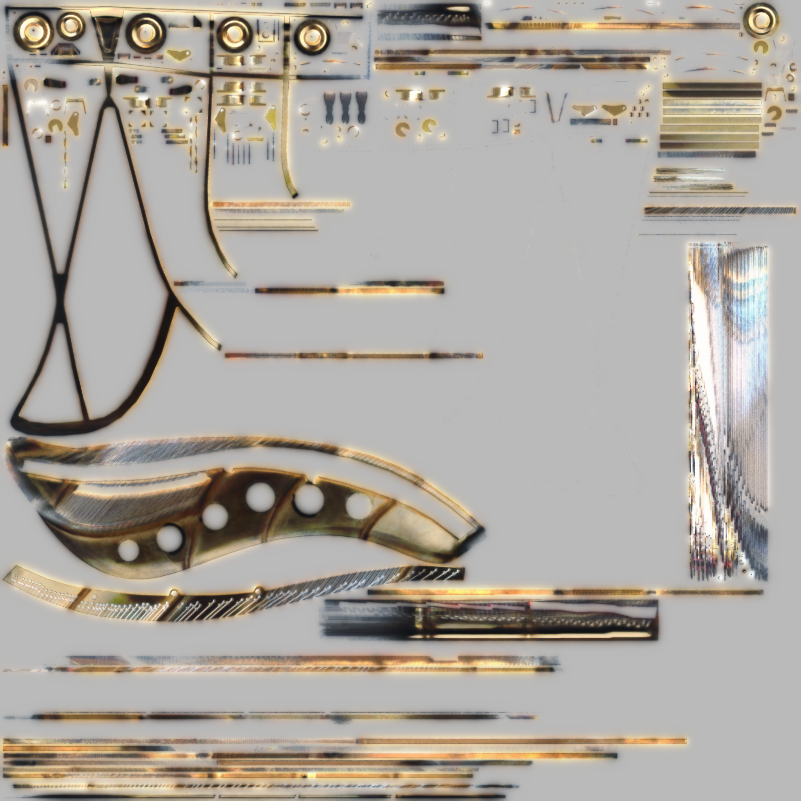
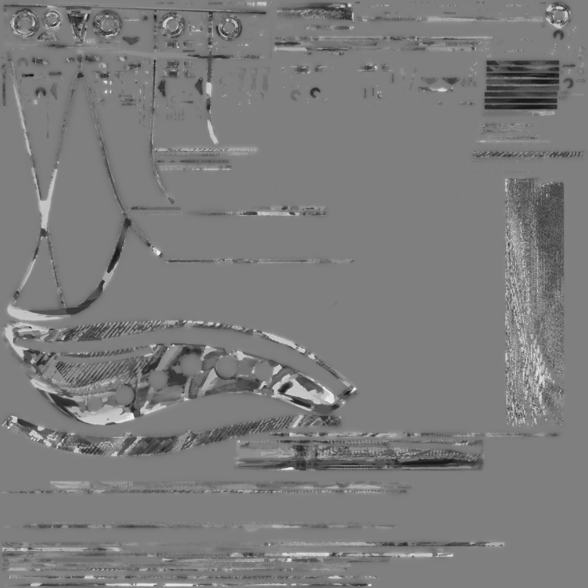

## 子 Mesh 材质 — Object_5（琴身/琴盖）

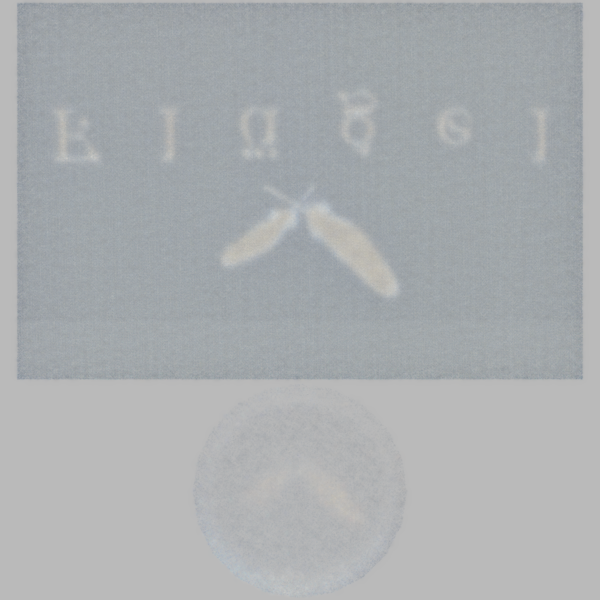
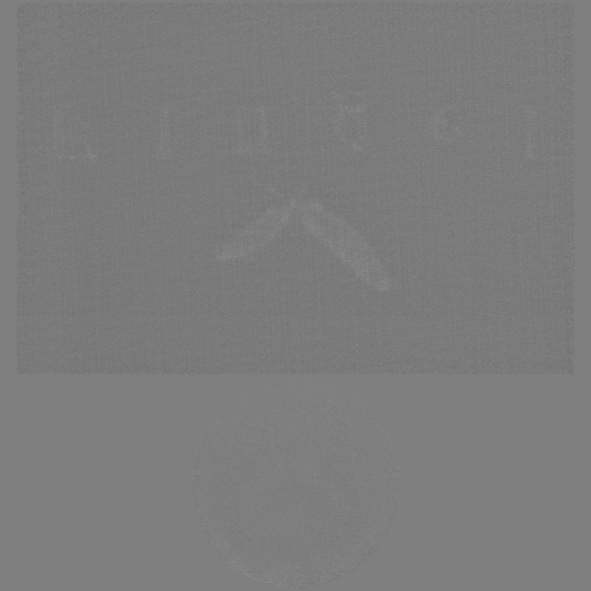

## 环境贴图

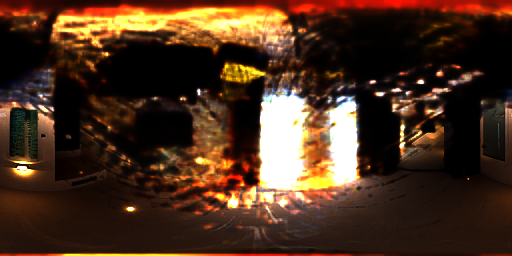

## 环绕视频

[▶ orbit](../../resource/piano_pbr_v2/orbit.mp4)

## 训练过程

| Epoch | PSNR | Resolution |
|-------|------|------------|
| 1 | ~13 dB | 512 |
| 200 | ~25 dB | 512 |
| 400 | ~27 dB | 1024 |
| 800 | ~28 dB | 1024 |
| 1000 | ~28.5 dB | 1024 |
| 2000 | **28.80 dB** | 1024 |

## 性能

| 分辨率 | 每 step | 2000 epochs |
|-------|---------|-------------|
| 512 | ~150 ms | ~5 min |
| 1024 | ~300 ms | ~10 min |

梯度累积将峰值 VRAM 从 14.8GB 降至 6.3GB，使 RTX 3080 10GB 可以完成训练。

## 关键发现

### 法线优化的灾难性退化

法线贴图优化在钢琴场景中导致了严重的质量崩塌：

1. **法线噪声 → 反射抖动**：normalize 在 (0,0,1) 附近梯度退化，微小的法线扰动被放大为剧烈的反射方向变化
2. **高光"水渍"伪影**：噪声法线导致粗糙表面上出现不规则的镜面高光斑块
3. **roughness 噪声雪上加霜**：优化器试图用粗糙度补偿法线噪声，导致两个通道同时退化
4. **小 submesh 梯度信号弱**：Object_0（62 面）梯度信号不足，法线优化噪声更严重

冻结法线后，优化器仅需拟合 base_color + roughness + metallic + env_map，收敛空间大幅简化，PSNR 从 21.95 → 28.80 dB。

### 梯度累积方案

逐 submesh 梯度累积等效于将所有 submesh 作为完整 batch 训练，数学近似等价（仅 SSIM 边界像素微小差异），VRAM 开销仅为单个 submesh 的开销。

## 相关文件

- 资源：`resource/piano_pbr_v2/`
- 输出：`output/piano_no_normal/epoch2000/`
- 配置：`configs/train_pbr_piano_multi_no_normal.yaml`
