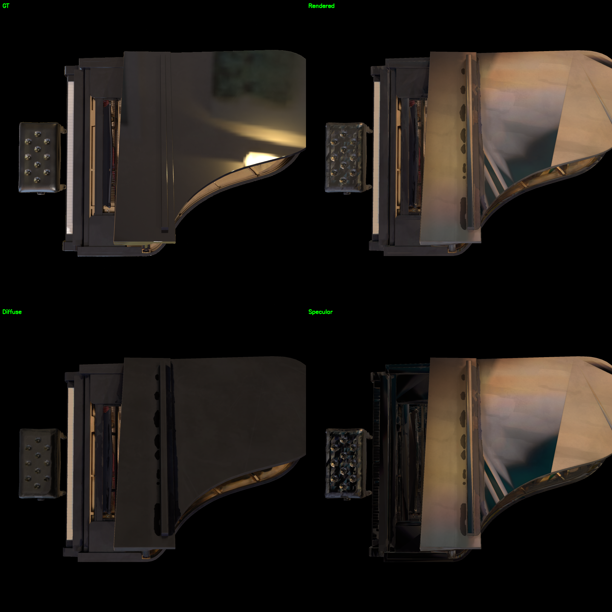
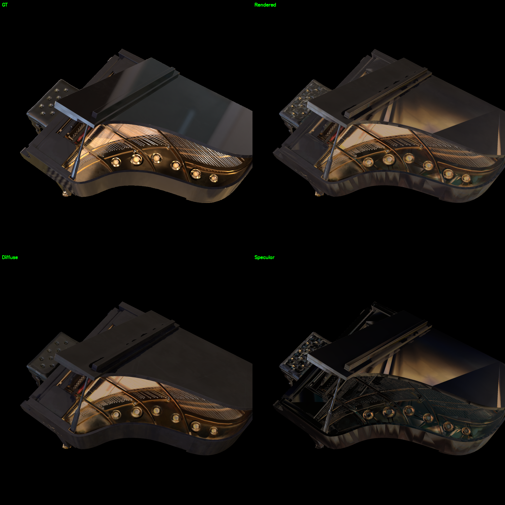
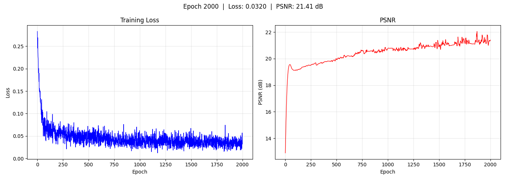
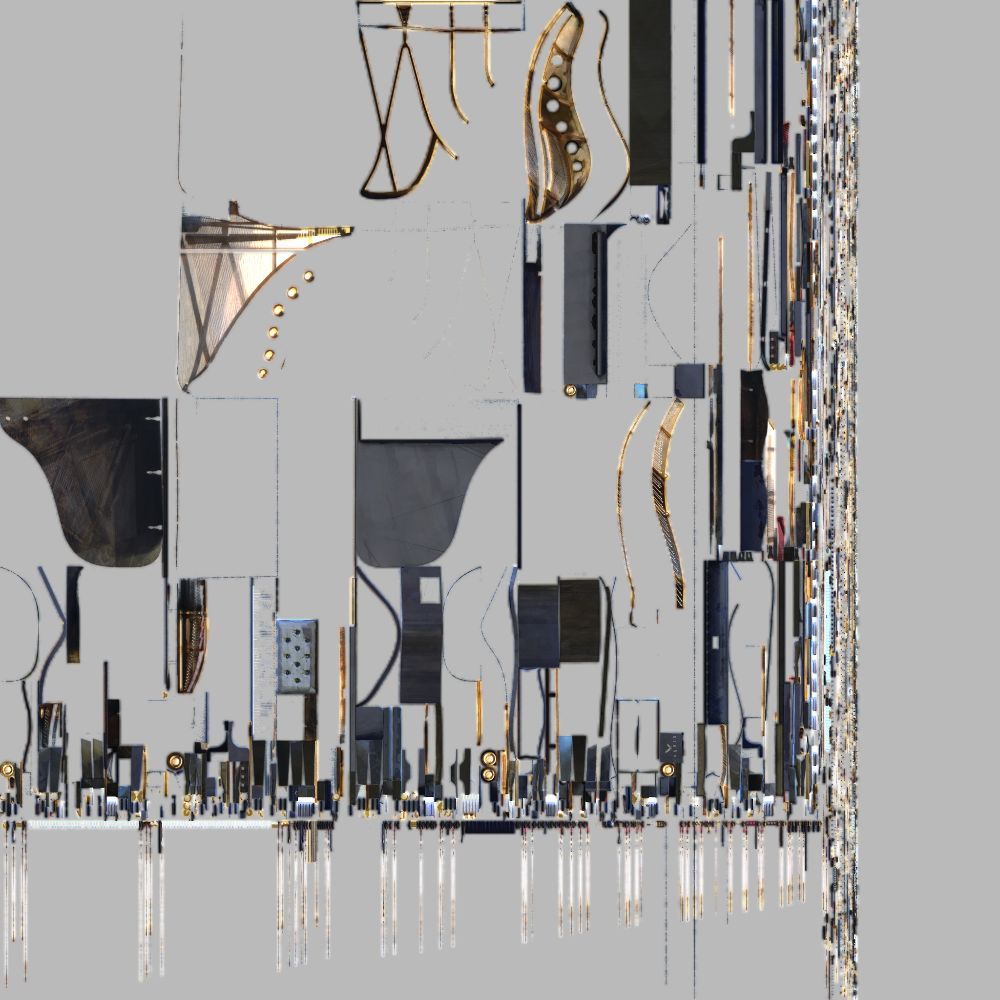
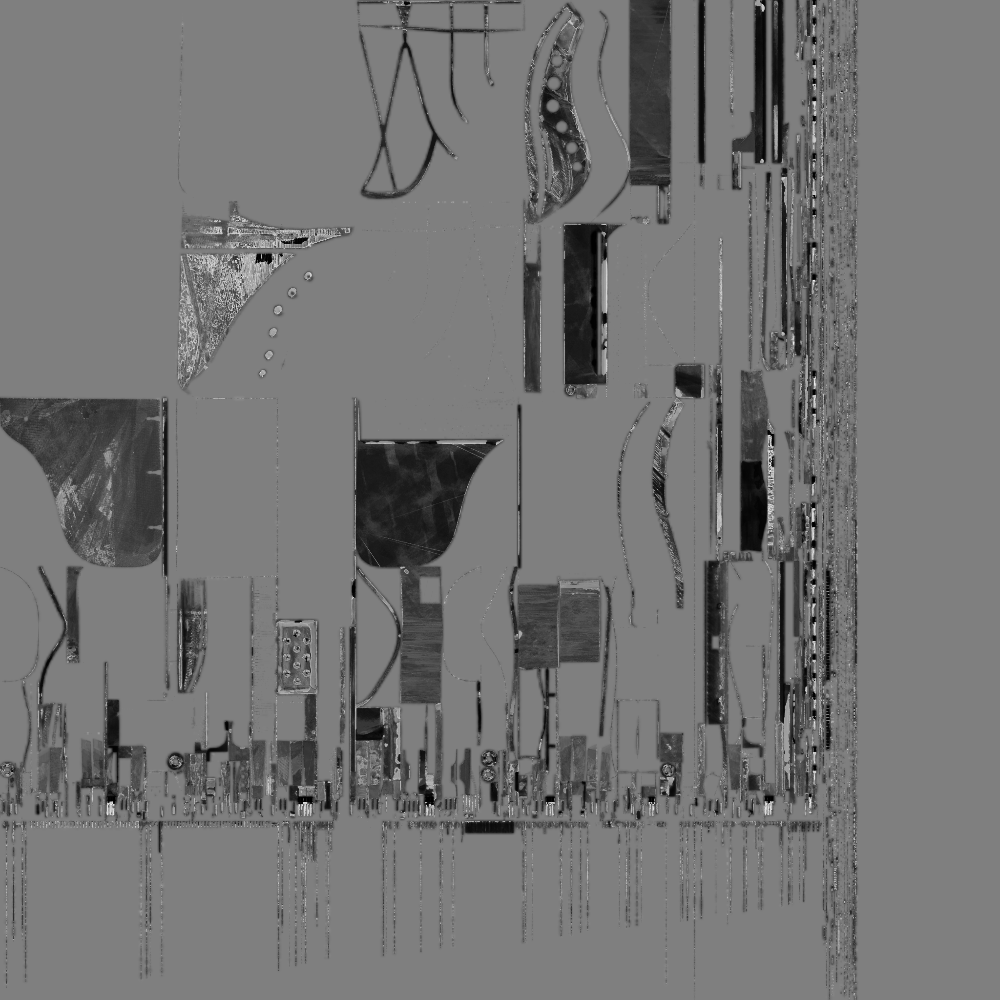
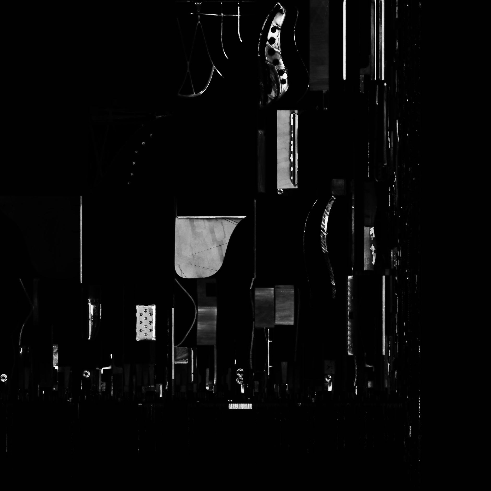
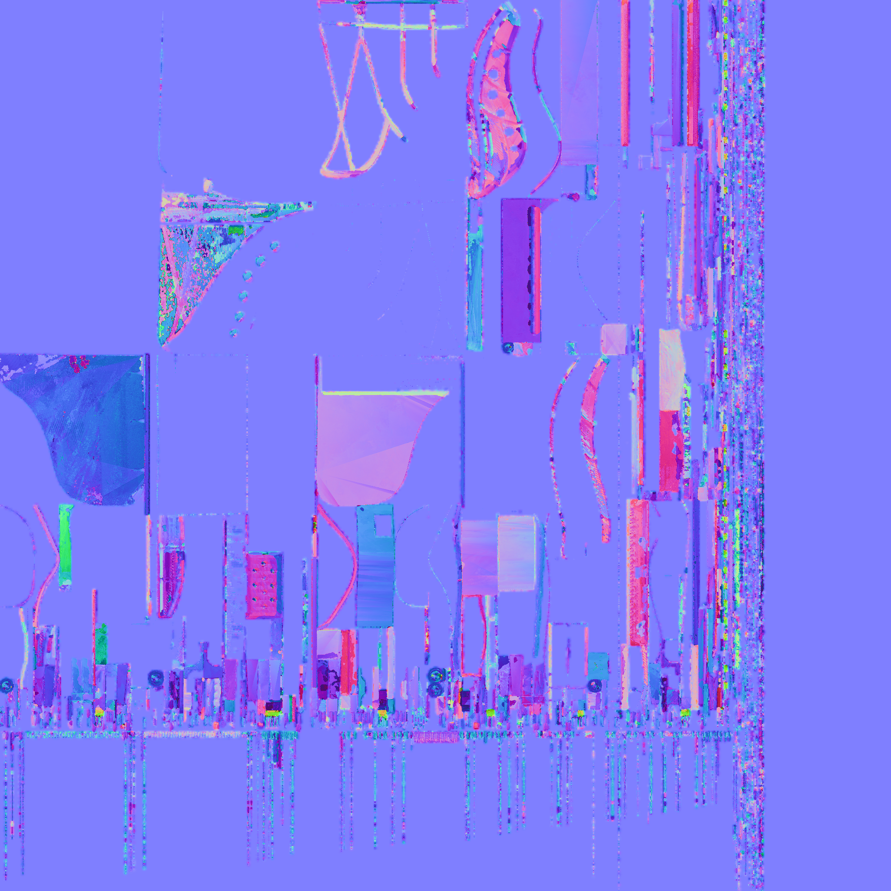

# 04 — Piano Scene (Single-Mesh PBR)

钢琴场景，使用 **单张共享材质纹理**（Single-Mesh PBR）。所有几何（琴身、琴键、琴弦、踏板）共享一张 2048×2048 的 8 通道纹理。

## 结果

| 指标 | 值 |
|------|-----|
| PSNR | **21.41 dB** |
| 纹理分辨率 | 2048×2048 |
| 输出 | `output/piano_260604_pbr/` |

## 训练过程

| Epoch | PSNR | Resolution |
|-------|------|------------|
| 1 | ~12 dB | 512 |
| 200 | ~18 dB | 512 |
| 1000 | ~21 dB | 2048 |
| 2000 | **21.41 dB** | 2048 |

## 渲染对比

## 训练曲线

## 材质贴图

## 环绕视频

<video src="../../resource/piano_pbr/orbit.mp4" width="30%"/>
<video src="../../resource/piano_pbr/orbit_diffuse.mp4" width="30%"/>
<video src="../../resource/piano_pbr/orbit_specular.mp4" width="30%"/>

## 问题分析

### 三角形走样
单张纹理强制所有 UV 岛共享一个纹理空间，不同材质区域在 UV 接缝处产生明显的三角形走样。这是多材质物体使用单纹理的最大问题。

### 材质平均化
单张 8 通道纹理无法表达钢琴不同部件的材质特性：
- **琴键**：白色，应略粗糙
- **琴身**：黑色亮面漆（低粗糙度高 specular）
- **琴弦**：金属（高金属度低粗糙度）
- **踏板**：金属黄铜

不同部件只能"折中"，导致每个部件都 sub-optimal。

### UV 空间竞争
不同部件竞争 UV 空间：
- 大面板获得高 texel 密度
- 小部件（琴键/琴弦）texel 密度低
- 材质过渡处的 UV 接缝产生插值伪影

## 与 Multi-Mesh 对比

| 方面 | Single-Mesh | Multi-Mesh |
|------|------------|------------|
| PSNR | 21.41 dB @ 2048 | **21.95 dB** @ 1024 |
| 纹理数量 | 1（8ch） | 6（8ch 各） |
| 三角走样 | 可见 | 无 |
| 部件材质 | 平均化 | 独立 |
| 最高分辨率 | 2048 | 1024 |

Multi-mesh 在更低分辨率下达到更高 PSNR，证明 per-part 材质独立比纹理分辨率更有效。

## 相关文件

- 输出：`output/piano_260604_pbr/epoch2000/`
- 资源：`resource/piano_pbr/`
