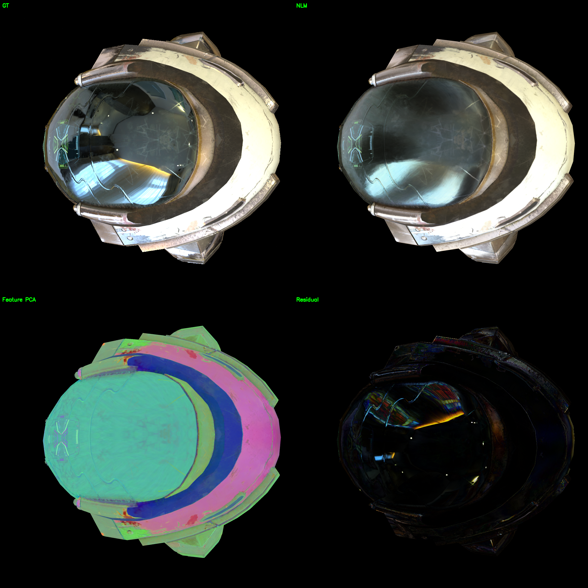
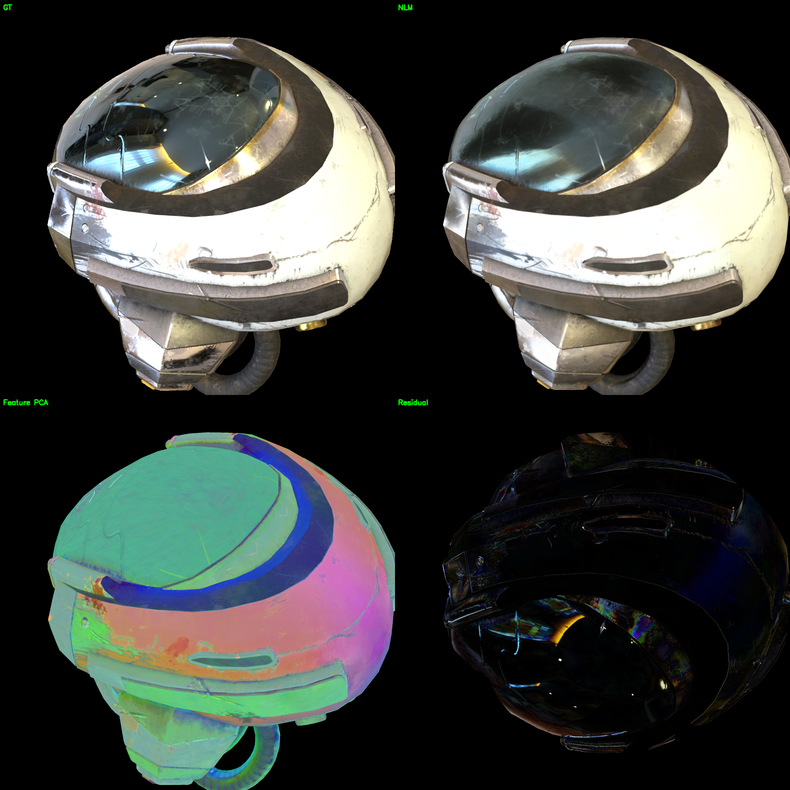
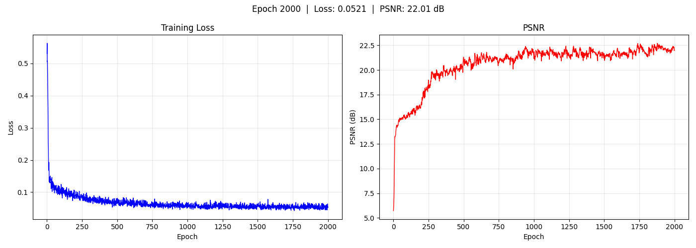

# Helmet — Neural Lightmap (L2 Reflect Encoding)

DamagedHelmet 头盔场景，使用 Neural Lightmap 着色。Per-submesh 可学习特征图 + 共享 TinyMLP 解码器，反射方向位置编码 PE(R) + NdotV 标量。

## 着色模型

```
L_o = Softplus( TinyMLP( feature ⊕ PE(R, L=2) ⊕ NdotV ) )

  R = 2(N·V)N - V            反射方向
  PE(R, L=2) → 15D           高频位置编码
  NdotV → 1D                 Fresnel 掠射角
  feature → 12D              per-submesh 可学习特征图
  TinyMLP: 28→32→32→3        全局共享解码器
```

## 实验配置

| 参数 | 值 |
|------|-----|
| 着色模型 | Neural Lightmap (NLM) |
| 网格 | `data/helmet_260604/scene/original_with_mats.glb`（14,588 顶点，1 submesh） |
| 特征图 | 12 通道，512 → 2048 |
| 视角编码 | PE(R) L=2 → 15D |
| MLP | 28→32→32→3→Softplus（~2K 参数） |
| 学习率 | feature 0.1 / MLP 0.001（TTUR 双时间尺度） |
| 正则化 | TV 1e-5 / L2 1e-4 |
| 训练轮数 | 2000 |
| 输出 | `output/helmet_nlm/` |

## 结果

| 指标 | 值 |
|------|-----|
| **PSNR** | **22.01 dB** |
| 对比 SH | **+8.82 dB** |
| 对比 PBR | **+1.20 dB** |

> NLM 在头盔上超过 PBR。反射方向编码 PE(R) 让 MLP 直接获取镜面反射的物理关键量，12D 特征图对单 submesh 容量充足。

## 渲染对比

左上 GT，右上 NLM 渲染，左下 Feature PCA，右下 Residual。

<p align="center">


</p>

## 训练曲线

<p align="center">

</p>

## 特征图 PCA 可视化

<p align="center">

</p>

12D 特征图经 PCA 降维到 3D 可视化。不同颜色区域对应头盔不同部位（面罩、外壳、衬垫），特征学到了有意义的结构分区。

## 环绕视频

<p align="center">[▶ orbit](../../resource/helmet_nlm/orbit.mp4)</p>

## 训练过程

| Epoch | PSNR | Resolution |
|-------|------|------------|
| 1 | ~5 dB | 512 |
| 200 | ~14 dB | 512 |
| 400 | ~18 dB | 1024 |
| 800 | ~20 dB | 2048 |
| 2000 | **22.01 dB** | 2048 |

## 编码方案演进

| 方案 | MLP 输入 | PSNR | 高光效果 |
|------|---------|------|---------|
| L0: PE(V) | feature(12) ⊕ PE(V)(15) = 27D | 13.03 dB | 无高光 |
| **L2: PE(R)+NdotV** | feature(12) ⊕ PE(R)(15) ⊕ NdotV(1) = 28D | **22.01 dB** | 高光出现 |

L0→L2 提升 +8.98 dB。仅靠视角方向 V 不足以建模镜面反射，必须用反射方向 R（直接编码"看到环境的哪一部分"）。

## 分析

头盔单 submesh 场景下 NLM 表现最优：
1. **高光捕捉**：PE(R) 编码反射方向，MLP 能学到视角相关的镜面反射
2. **超过 PBR**：PBR 受 split-sum 近似限制（无 GI、无阴影），NLM 的隐式表达更灵活
3. **无颗粒感**：小 MLP（32 宽度）容量有限，天然倾向平滑映射，特征图无噪声

## 相关文件

- 资源：`resource/helmet_nlm/`
- 输出：`output/helmet_nlm/epoch2000/`
- 配置：`configs/train_nlm_helmet.yaml`
