# Piano — PBR Split-Sum (Multi-Mesh)

钢琴场景多 mesh PBR 方案。6 个子 mesh 各自拥有独立 1024×1024 的 8 通道材质纹理。使用原始高模几何（`original_with_mats.glb`，~99K 顶点）与 GT 完全对齐。

## 子 Mesh 结构

| 子 Mesh | 面数 | 描述 |
|---------|------|------|
| Object_0 | 62 | 小型组件 |
| Object_1 | 1,428 | 中型组件 |
| Object_2 | 1,800 | 中型组件 |
| Object_3 | 3,800 | 大型组件 |
| Object_4 | 44,351 | 琴身主体 |
| Object_5 | 47,831 | 琴身/琴盖 |
| **总计** | **~99K 顶点** | 高模原始几何 |

## 实验配置

| 参数 | 值 |
|------|-----|
| 着色模型 | PBR (GGX split-sum) |
| 网格 | `data/piano_260604/scene/original_with_mats.glb` |
| 纹理方案 | 6 独立 8 通道纹理，各 1024×1024 |
| 纹理分辨率 | 512 → 1024 |
| 训练轮数 | 2000 |
| 训练时间 | ~28 分钟 |
| 输出 | `output/piano_260604_pbr_multi/` |

## 结果

| 指标 | 值 |
|------|-----|
| **峰值 PSNR** | **21.95 dB**（epoch 1800） |
| 最终 PSNR | 20.83 dB（epoch 2000） |
| 对比 Single-Mesh | **+0.54 dB** @ 更低分辨率 |

## 渲染对比

左上 GT，右上渲染，左下 Diffuse，右下 Specular。

<p align="center">
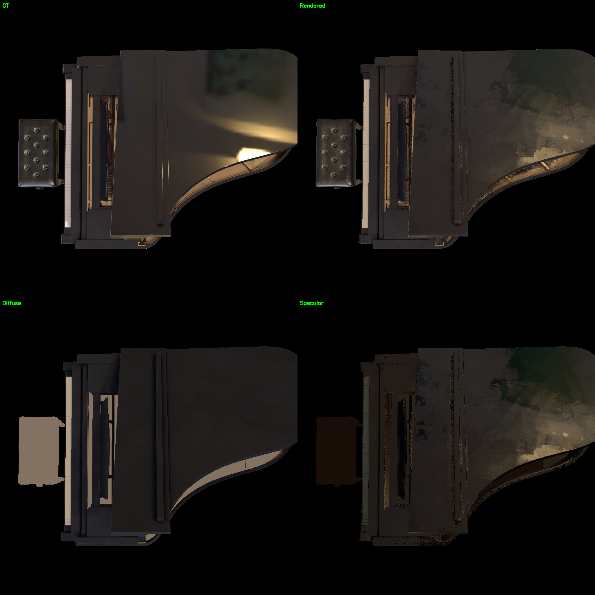
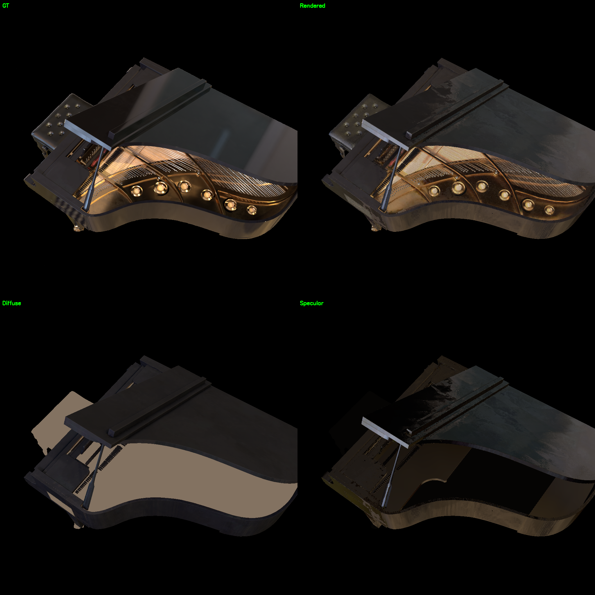
</p>

## 训练曲线

<p align="center">
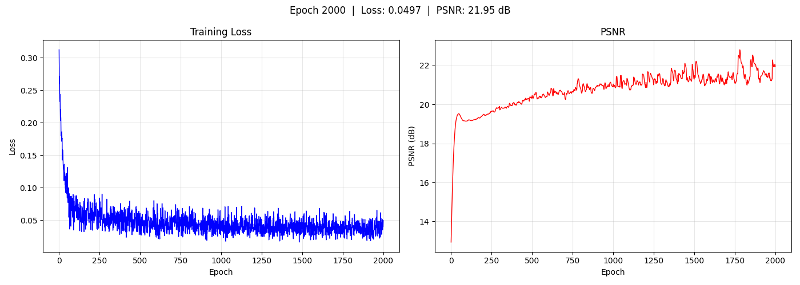
</p>

## 子 Mesh 材质 — Object_4（琴身主体，最大子 mesh）

<p align="center">
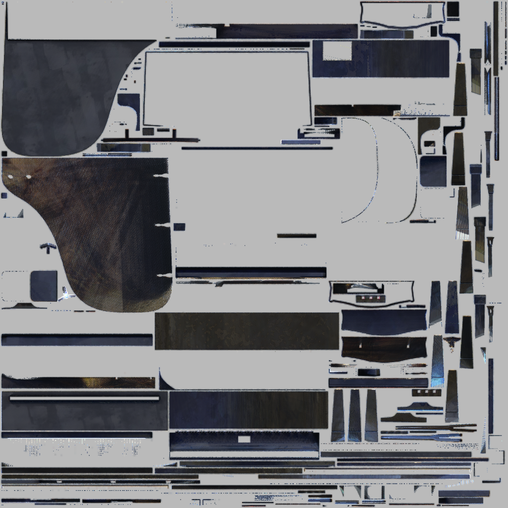
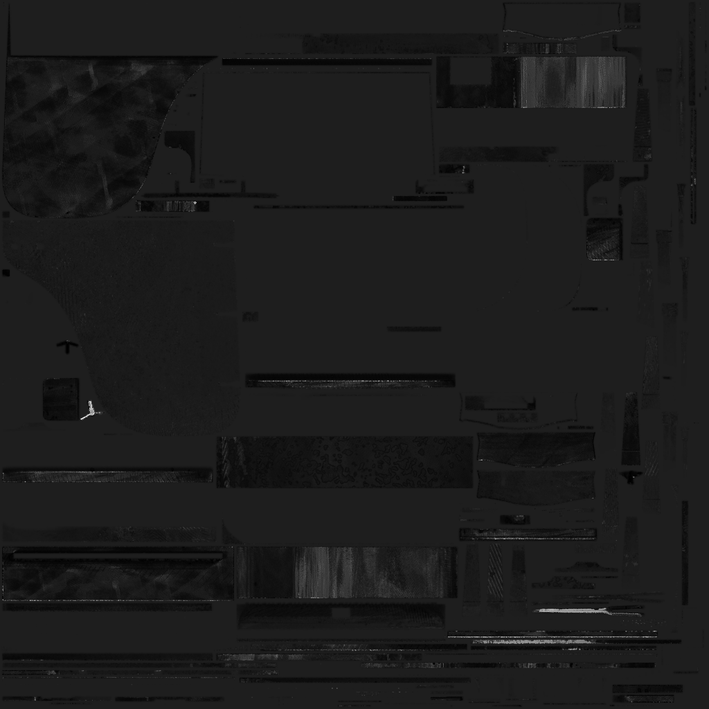
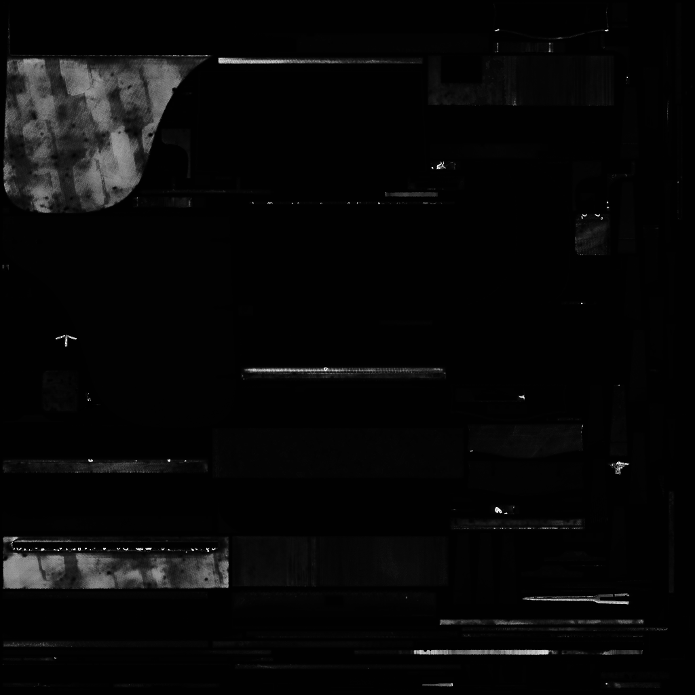
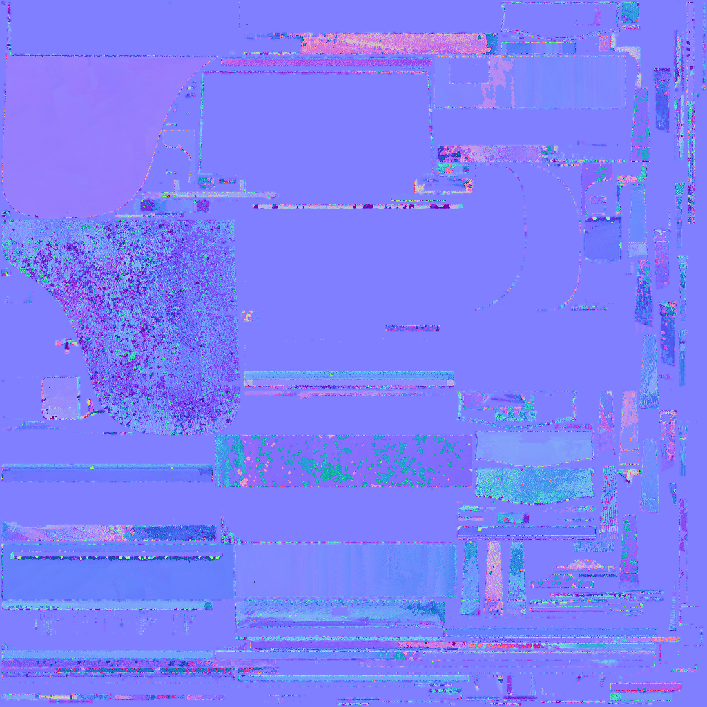
</p>

## 子 Mesh 材质 — Object_3（大型组件）

<p align="center">
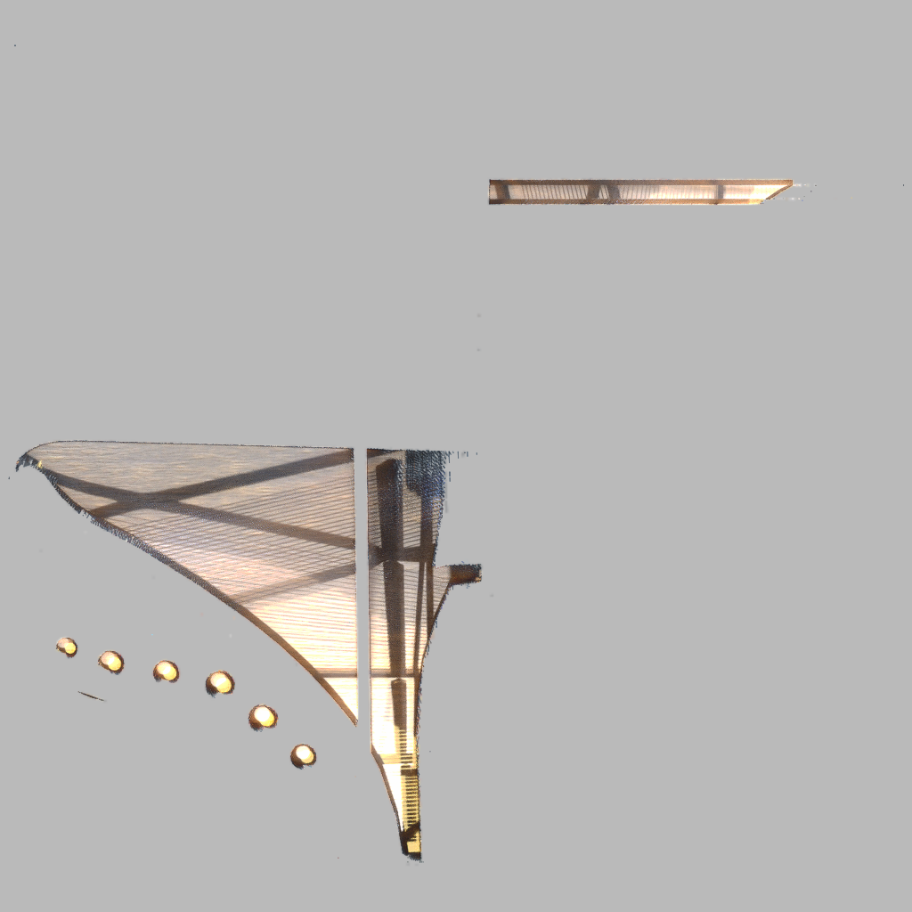
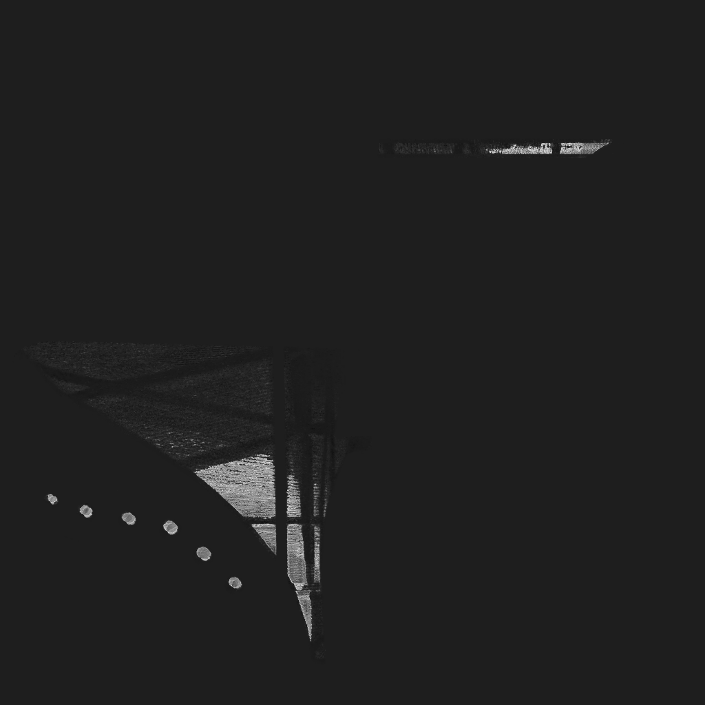

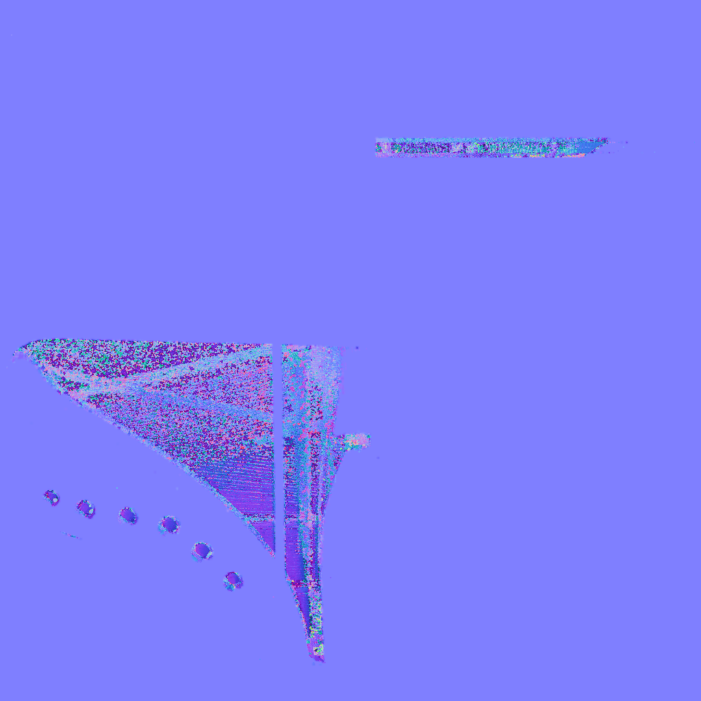
</p>

## 环境贴图

<p align="center">
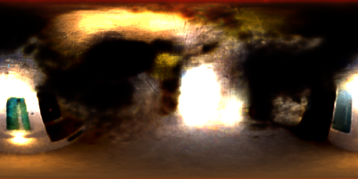
</p>

## 环绕视频

<p align="center">
<video src="../../resource/piano_pbr_multi/orbit.mp4" width="50%"/>
</p>

## 训练过程

| Epoch | PSNR | Resolution |
|-------|------|------------|
| 1 | 12.88 dB | 512 |
| 200 | 19.42 dB | 512 |
| 600 | 20.21 dB | 1024 |
| 1000 | 20.66 dB | 1024 |
| 1400 | 20.90 dB | 1024 |
| **1800** | **21.95 dB** | 1024 |
| 2000 | 20.83 dB | 1024 |

## 渲染架构

```
glTF → gltf_loader → 6 × SubMeshData → per-submesh renderers

每帧合成：
  for each submesh:
      rasterize + shade_submesh(name, ...) → rgb_sub, mask_sub, depth
  depth-based composite:
      argmin(depth) → frontmost per pixel
      torch.gather → differentiable selection
```

## 性能

| 分辨率 | 每 step | 2000 epochs |
|-------|---------|-------------|
| 512 | 126 ms | 17 min |
| 1024 | 172 ms | **23 min** |
| 2048 | 7716 ms | 17 hours |

当前配置 max resolution = 1024，2000 轮 ~28 分钟完成。

## 待解决问题

1. **Specular 质量**：粗糙度对光洁表面收敛偏慢，高光不够锐利
2. **"水渍"伪影**：小 submesh 梯度信号弱，纹理噪声明显
3. **单 mesh 兼容**：gltf_loader 根节点 transform 与 trimesh 坐标系不一致

## 相关文件

- 资源：`resource/piano_pbr_multi/`
- 输出：`output/piano_260604_pbr_multi/epoch2000/`
