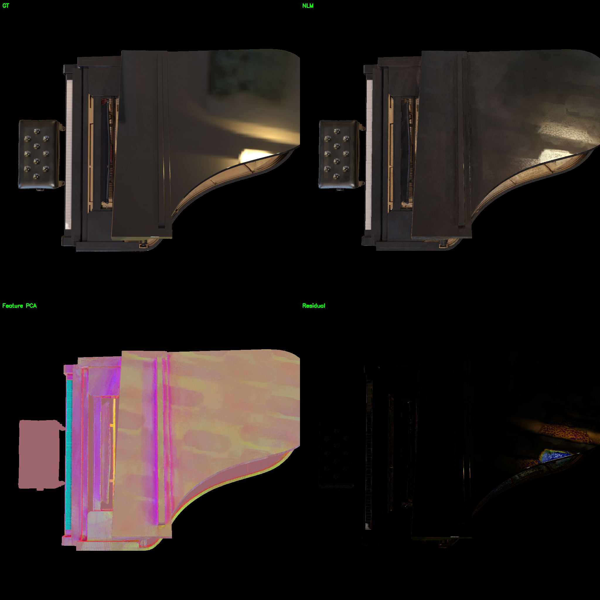
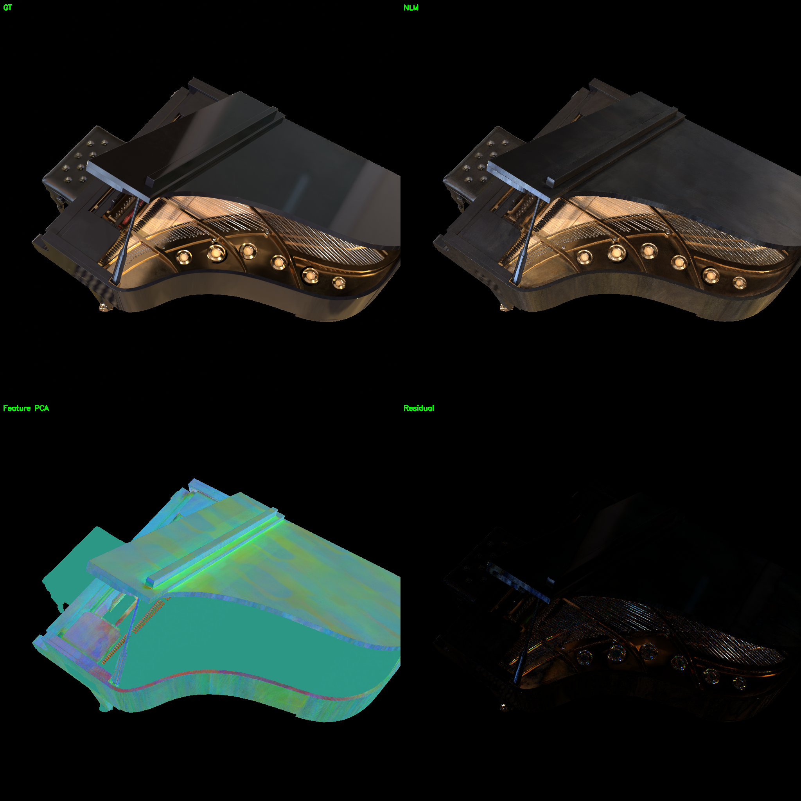
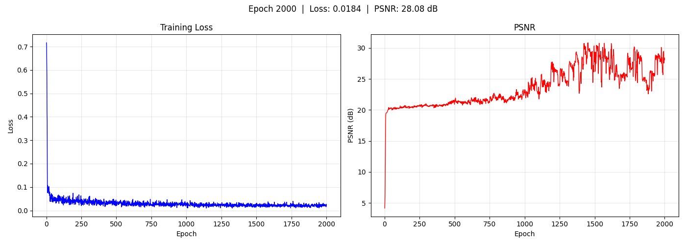
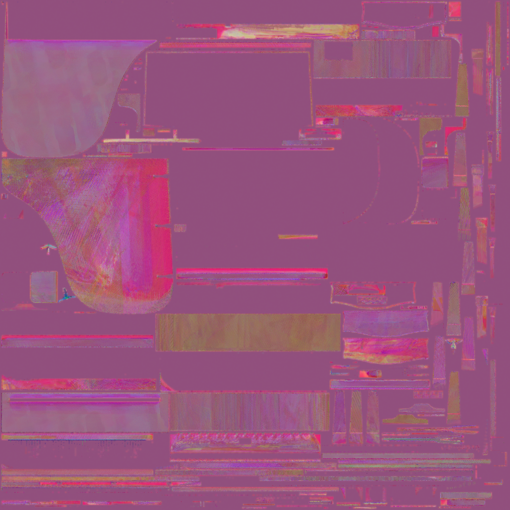
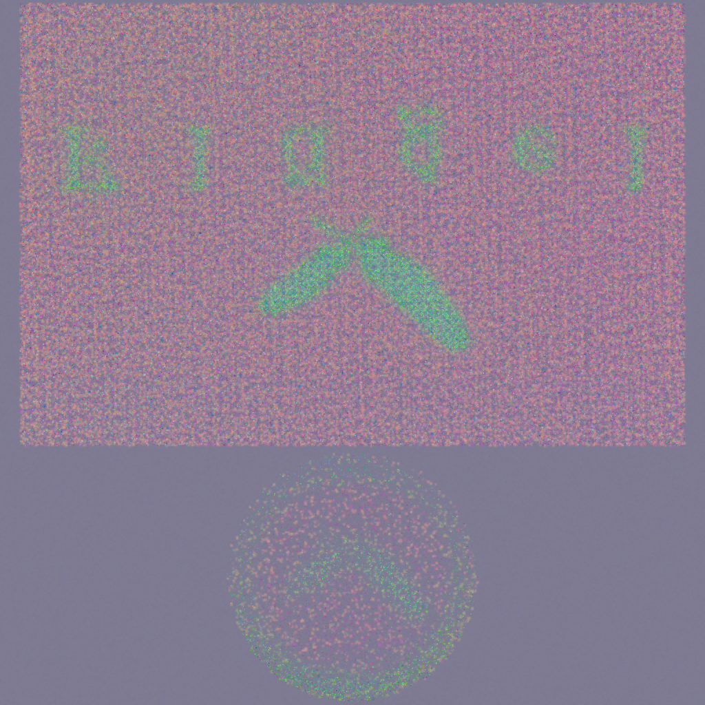

# Piano — Neural Lightmap (Large Config, Multi-Mesh)

钢琴场景多 mesh Neural Lightmap。6 个 submesh 各自拥有独立特征图，共享 TinyMLP 解码器。使用大参数配置（feature_dim=24, PE L=4, MLP 64）。

## 着色模型

```
L_o = Softplus( TinyMLP( feature ⊕ PE(R, L=4) ⊕ NdotV ) )

  R = 2(N·V)N - V            反射方向
  PE(R, L=4) → 27D           高频位置编码（最高频 8π）
  NdotV → 1D                 Fresnel 掠射角
  feature → 24D              per-submesh 可学习特征图
  TinyMLP: 52→64→64→3→Softplus（~8K 参数）
```

## 实验配置

| 参数 | 值 |
|------|-----|
| 着色模型 | Neural Lightmap (NLM) |
| 网格 | `data/piano_260604/scene/original_with_mats.glb`（~99K 顶点，6 submesh） |
| 特征图 | 6 独立 24 通道纹理，各 512 → 1024 |
| 视角编码 | PE(R) L=4 → 27D |
| MLP | 52→64→64→3→Softplus（~8K 参数） |
| 学习率 | feature 0.1 / MLP 0.001（TTUR） |
| 正则化 | TV 1e-3 / L2 1e-4 |
| 训练轮数 | 2000 |
| 输出 | `output/piano_nlm_large/` |

## 结果

| 指标 | 值 |
|------|-----|
| **PSNR** | **28.08 dB** |
| 对比 SH | **+7.71 dB** |
| 对比 PBR | **-0.43 dB** |

> 接近 PBR（28.51 dB），差距仅 0.43 dB。NLM 用隐式神经解码逼近了 PBR split-sum 的物理近似效果。

## 渲染对比

左上 GT，右上 NLM 渲染，左下 Feature PCA，右下 Residual。

<p align="center">


</p>

## 训练曲线

<p align="center">

</p>

## 子 Mesh 特征图 PCA — Object_4（琴身主体）

<p align="center">

</p>

## 子 Mesh 特征图 PCA — Object_5（琴身/琴盖）

<p align="center">

</p>

## 环绕视频

<p align="center">[▶ orbit](../../resource/piano_nlm_large/orbit.mp4)</p>

## 参数演进

| 配置 | feature_dim | PE level | MLP | PSNR | 备注 |
|------|------------|----------|-----|------|------|
| 小参数 | 12 | L=2 | 32 | 20.76 dB | 高光弱，容量不足 |
| **大参数** | **24** | **L=4** | **64** | **28.08 dB** | 高光捕捉到，接近 PBR |

小→大提升 **+7.32 dB**。6 submesh 场景需要更大特征容量和更高频编码。

## 遗留问题

### 问题一：PSNR 后期震荡

训练曲线显示 PSNR 在 epoch 1000 后出现明显震荡（±2~3 dB，区间 25~30 dB），而 Loss 保持平稳（~0.02）。最终 PSNR 28.08 dB 是震荡期间的一个较高采样点，并非稳定收敛值。

**原因推测**：大参数配置（feature_dim=24, PE L=4）下联合优化的解空间存在多个局部最优，每个 batch 的不同视角采样导致参数在不同局部最优间跳跃。Loss 已收敛（L1 主导），但 PSNR 对视角相关的高频细节更敏感，表现出震荡。这与下面的颗粒感问题同源——都是联合优化非唯一性的表现。

### 问题二：渲染颗粒感

大参数配置下渲染结果存在像素级颗粒感（尤其在深色表面区域）。

**根因分析**：

联合优化（特征图 + MLP）的非唯一性导致。MLP 有足够能力将空间不连续的特征图解码成大致正确的 RGB，L1 loss 只约束渲染结果不约束特征平滑度。特征图 UV 空间的 TV/L2 正则化无法解决此问题——颗粒产生在 MLP 屏幕空间解码阶段，而非特征图本身。

**已验证无效的方案**：
- TV weight 1e-5 → 1e-3（提高 100 倍）
- L2 weight 0 → 1e-4
- 均作用在特征图 UV 空间，对屏幕空间颗粒无效

**下一步方向**：
- 屏幕空间 TV loss（直接对渲染输出 `rgb_sub` 做 TV 约束）
- 或降低 PE level（L=4→L=3，减少高频振荡）

## 相关文件

- 资源：`resource/piano_nlm_large/`
- 输出：`output/piano_nlm_large/epoch2000/`
- 配置：`configs/train_nlm_piano_multi_large.yaml`
